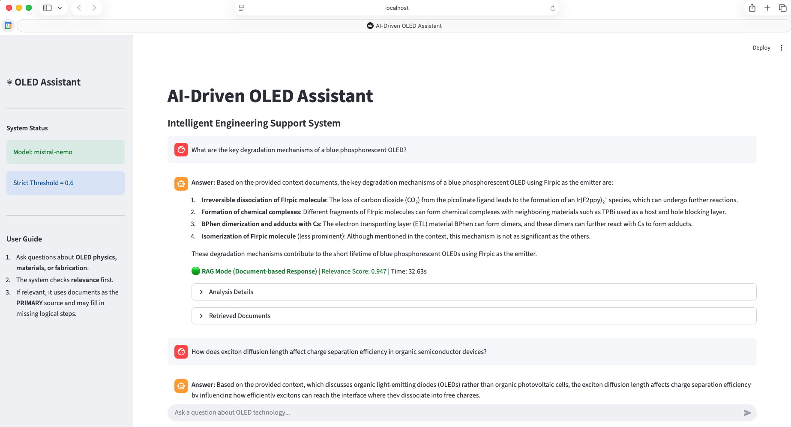
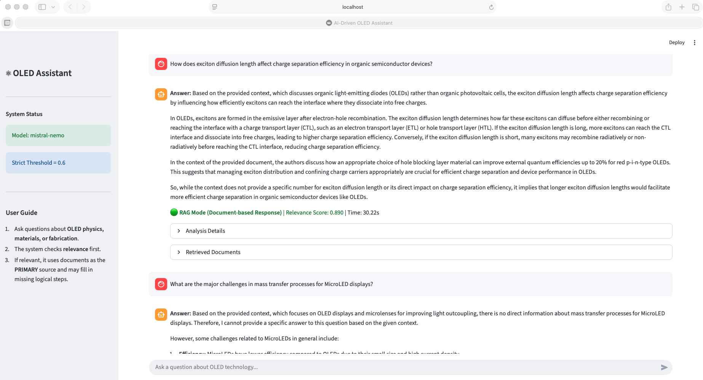
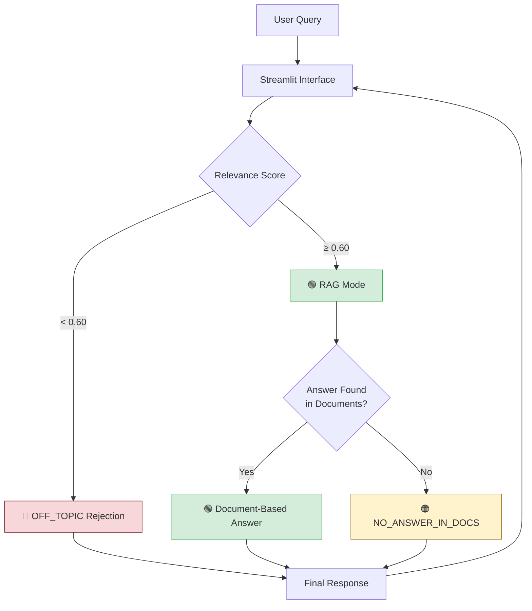

# AI-Driven OLED Assistant


An intelligent, secure, and domain-specific RAG (Retrieval-Augmented Generation) assistant for OLED display engineers.

## 🌟 Overview
This tool allows engineers to ask technical questions about OLED physics, fabrication, and materials. It uses a **Strict RAG** engine to ensure that all answers are derived *exclusively* from internal technical documents, eliminating hallucinations.

### Key Features
- **Strict RAG for Experts**: Designed for PhD-level engineers. It answers **ONLY** using verified internal technical documents, strictly avoiding generic internet-based knowledge (blogs, Wikipedia) to ensure high-precision insights that Google cannot provide.
- **Secure & Local**: Runs entirely on your machine using **Mistral-Nemo** via Ollama. No data leaves the laptop.
- **Zero-Latency Startup**: Uses a pre-computed ChromaDB vector store.
- **Commercial-Grade Accuracy on Local Hardware**: Through rigorous prompt optimization and hyperparameter tuning, we achieved answer quality comparable to cloud-based commercial models (GPT-4o-mini), validated by PhD-level experts.

---

## 📸 Screenshots

| RAG Mode - Document-based Answer | Multi-turn Conversation |
|:---:|:---:|
|  |  |

*The assistant provides detailed, document-grounded answers with relevance scores and response times.*

---

## 💡 Key Motivation

### Why Strict RAG? (No LLM Fallback)

This tool is designed for **PhD-level domain experts** who need precise, actionable answers—not generic information they could find on Google.

| Standard RAG | Strict RAG (This Tool) |
|--------------|------------------------|
| Falls back to LLM knowledge if documents lack info | Returns "No Answer" if documents lack info |
| May include news/Wikipedia-level knowledge | Answers **only** from verified internal documents |
| Risk of plausible but non-professional answers | Guarantees every answer is traceable to source |

**Why "No Answer" is better than LLM Fallback:**
- If information isn't in our documents, it means **the work hasn't been done yet**.
- Returning a "plausible guess" from LLM knowledge would be **dangerous in production** settings.
- Engineers need to know when something is missing so they can **identify it as a next step** in their actual work.
- Generic answers from news/blog or Wikipedia are **not what experts need**—they can Google that themselves.

> **Design Philosophy**: This is a tool for practitioners who need answers grounded in real internal data, not speculation.

---

### On-Premise LLM vs Commercial API

A key finding from this project:

> **With proper optimization, on-premise LLMs can achieve commercial-tool-level performance.**

| Aspect | Commercial (GPT-4o) | On-Premise (Mistral-Nemo) |
|--------|---------------------|---------------------------|
| Native capability | Higher | Medium |
| Latency | Network-dependent | Faster (local) |
| Data privacy | Cloud-based | 100% local |
| Cost | Pay-per-token | Free |
| **Optimized performance** | Best with optimization | **Comparable** with optimization |

**How we achieved this:**
1. **Prompt Optimization**: Carefully engineered prompts for domain-specific responses
2. **High-Quality RAG Data**: Curated internal technical documents
3. **Hyperparameter Tuning**: Systematic experiments to find optimal settings (chunk size, relevance threshold, etc.)

The result: PhD-level experts validated that the optimized Mistral responses are **indistinguishable in quality** from GPT-4o-mini for our domain-specific use case.

> **Note**: This doesn't mean Mistral is "better" than GPT—it means that with the right optimization, you can achieve production-grade results with local, private infrastructure.

---

## 🛠️ Tech Stack


### Architecture Choices
- **App Interface**: `Streamlit` was chosen for rapid prototyping and its native support for chat interfaces (`st.chat_message`).
- **LLM Serving**: `Ollama` enables **Mistral-Nemo 12B** to run locally, ensuring **100% data privacy** for sensitive OLED technical documents.
- **RAG Orchestration**: `LangChain` provides the RAG chain (`RetrievalQA`) for document retrieval and answer generation, while custom sigmoid-based relevance scoring handles strict filtering.
- **Vector Database**: `ChromaDB` (Persistent) enables fast startup by storing pre-computed embeddings locally, eliminating the need to re-index documents on every launch.

---

## System Architecture

The system follows **Strict RAG** logic: queries are first scored for relevance, then answered only from documents.



**Key Decision Points:**
- **Relevance Threshold (0.60)**: Queries below this are automatically rejected as off-topic
- **Document Check**: Even high-relevance queries may return "No Answer" if documents lack the specific information

---

## 🚀 Quick Start

### Option 1: Engineering Standard (Run Locally)
Use this if you want to install and run the app on your own machine.

1. **Clone & Setup**
   ```bash
   ./setup.sh
   ```
   *This will check Python, create a virtual environment, install dependencies, and pull the Mistral model.*

2. **Run the App**
   ```bash
   ./run_app.sh
   ```

### Option 2: Live Demo (Tunneling)
Use this to share a live link with colleagues without them installing anything.

1. **Start Demo**
   ```bash
   ./start_demo.sh
   ```
   *This will generate a public HTTPS link (ngrok) that you can share.*

---

## 📂 Project Structure

```text
oled-assistant/
├── src/                  # Source Code
│   ├── __init__.py       # Package marker
│   ├── app.py            # Main Streamlit Application
│   ├── rag_engine.py     # Strict RAG Logic Class
│   ├── config.py         # Configuration & Hyperparameters
│   └── utils.py          # Logging & Helper Functions
├── notebooks/            # Development Notebooks
│   ├── OLED_assistant_v1_HP_tuning.ipynb  # Hyperparameter tuning
│   ├── OLED_assistant_v2_Mistral.ipynb    # Mistral integration
│   └── OLED_assistant_v3_final.ipynb      # Strict RAG (Final)
├── chroma_db/            # Pre-computed Vector Database
├── docs/                 # Documentation & Experiments
│   ├── architecture.md   # System Flowchart
│   ├── rag_engine.md     # Logic Explanation
│   ├── hyperparameter.md # Hyperparameter Tuning Guide
│   ├── llm_comparison.md # LLM Comparison Results
│   └── experiments/      # Research Data (logs, CSVs)
├── logs/                 # Usage Logs
├── screenshot/           # Demo Screenshots
├── setup.sh              # Installation Script
├── run_app.sh            # Run Script
├── start_demo.sh         # Ngrok Tunneling Script
├── requirements.txt      # Python Dependencies
└── README.md             # This file
```

## 🧠 Documentation
- [System Architecture](docs/architecture.md)
- [RAG Engine Logic](docs/rag_engine.md)
- [Hyperparameter Tuning](docs/hyperparameter.md)
- [LLM Comparison](docs/llm_comparison.md)

## 🔮 Future Work

### LLM Fine-Tuning (Next Phase)

- **Goal**: Build an OLED-specialized Mistral that natively understands domain terminology
- **Expected Benefits**: Faster responses, better consistency, reduced prompt complexity
- **Approach**: QLoRA fine-tuning with 500+ expert-validated Q&A pairs from internal documents

---
**Developed by CYJ for XF Team**
