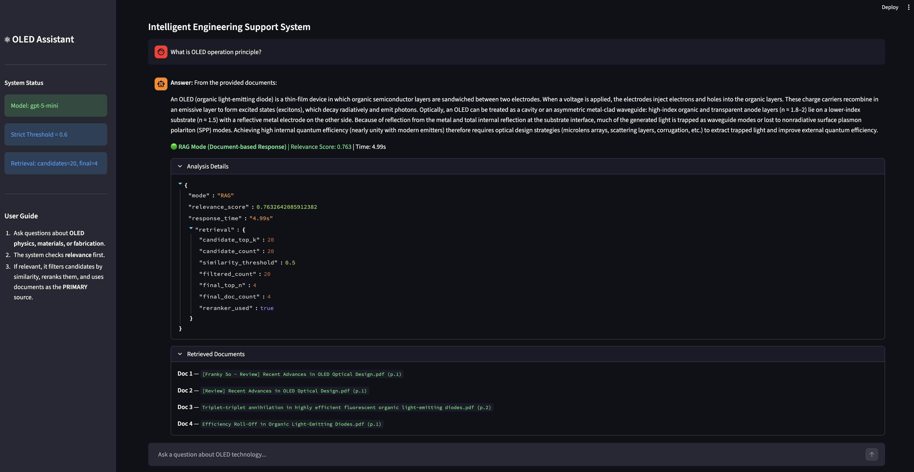
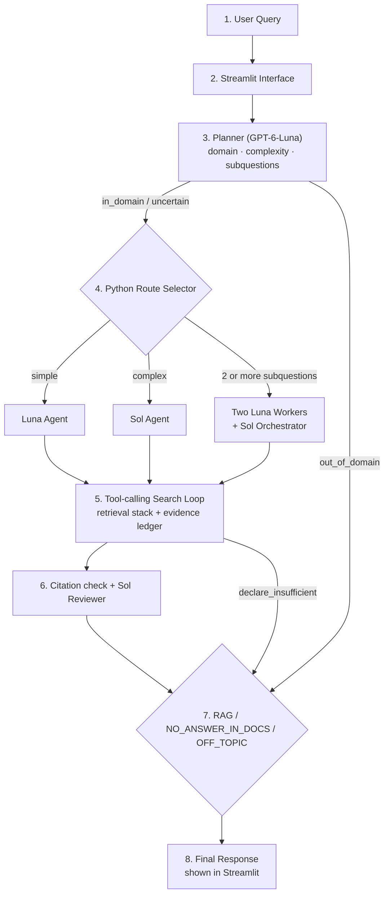
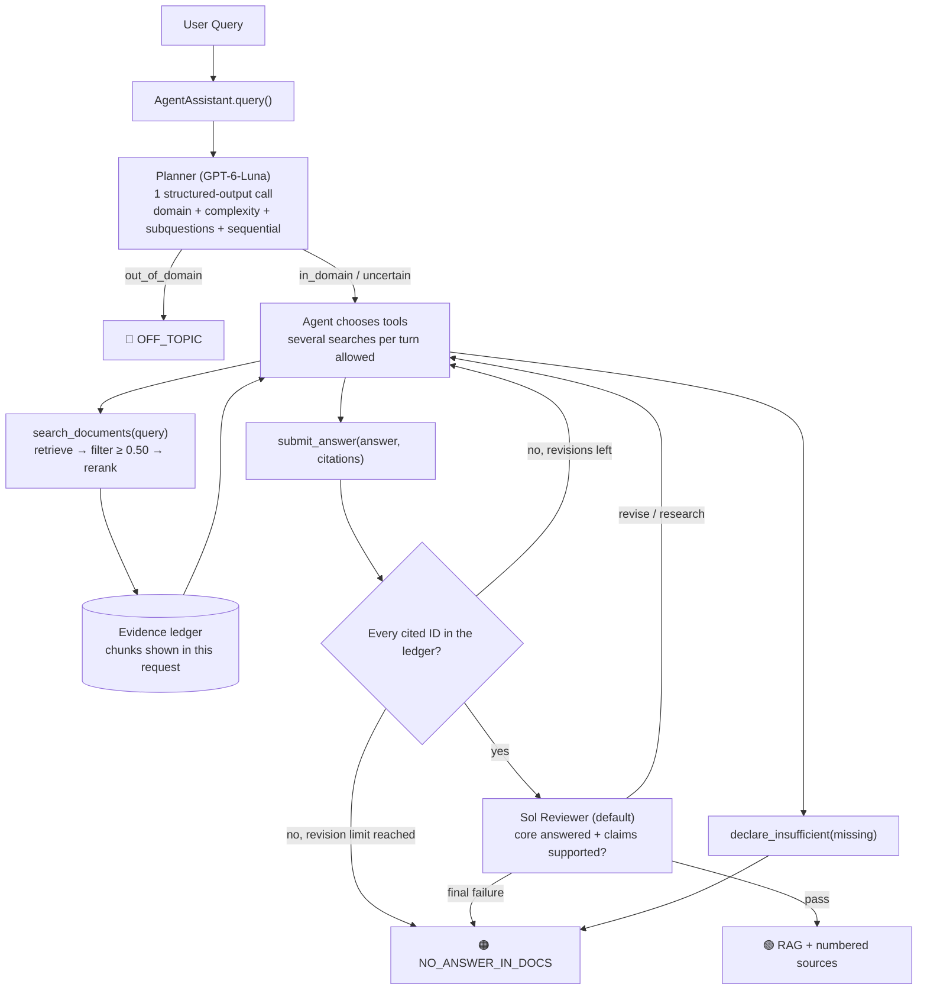

# AI-Driven OLED Assistant

      

An agentic RAG (Retrieval-Augmented Generation) assistant for OLED display engineers, with multi-agent patterns, model routing, and a Kubernetes deployment.

## Overview

This tool allows engineers to ask technical questions about OLED physics, fabrication, and materials. Every question is answered by a **tool-calling agent**: it plans first, searches the documents (several searches per turn when useful), searches again with reworded queries when the results are weak, and has to cite the chunks it was shown.

On top of the single agent, three patterns can be switched independently with environment flags, and the measured default uses all three:

- **Model routing**: GPT-6-Luna (light) answers simple questions and GPT-6.1-Sol (heavy) answers complex ones, with at most one escalation from Luna to Sol.
- **Orchestrator-worker**: two Luna workers research separate sub-questions, and a Sol orchestrator checks their findings against the original chunks and writes the answer.
- **Reviewer**: Sol checks every claim against the cited chunks before the answer is accepted.

The answers follow a **Strict RAG** policy: there is no fallback to the model's own knowledge, and the agent returns "No Answer" when the documents cannot support a response. All limits (searches, LLM calls, time) are enforced in Python. See [How the Agent Works](#how-the-agent-works).

### Key Features

- **Strict Document-Grounded RAG**: The system has no unrestricted LLM fallback. It rejects off-topic questions at the planning step and returns `NO_ANSWER_IN_DOCS` when the retrieved evidence does not answer the core of the question.
- **Agent Planning and Re-Search**: The planner fixes typos and abbreviations and splits multi-part questions, and the agent searches again when the results are weak. A per-request evidence ledger makes sure it can only cite chunks it was actually shown.
- **Multi-Model Routing and Multi-Agent Patterns**: The planner rates how complex a question is, Python sends easy questions to the light model and hard ones to the heavy model, and a failed light run can escalate once in a fresh context. The orchestrator-worker and reviewer share the same ledger and budgets. In our tests, workers improved multi-step retrieval while the reviewer caught answers that only covered related facts, so both are on by default.
- **Verified Source Links**: Answers list the cited paper titles with DOI links that were verified against Crossref (`src/source_registry.json`). Titles and URLs always come from this registry, so the model never writes them itself.
- **Evaluation Pipeline**: `scripts/evaluate_agent.py` runs any agent configuration on 50 questions and reports false rejections, false acceptances, unsupported claims (graded by an independent judge model), latency, tokens per model, and cost.
- **Kubernetes Deployment**: The same Docker image runs on Kubernetes with resource requests/limits, readiness and liveness probes, rolling back through `kubectl rollout undo`, and the API key stored in a Kubernetes Secret.
- **Public Cloud Demo**: The application is deployed on Google Cloud Run and calls GPT-6-Luna and GPT-6.1-Sol through the OpenAI Responses API.
- **Privacy-First Internal Track**: The original internal deployment used **Mistral-Nemo via Ollama** on local hardware so sensitive OLED documents did not leave the machine. This remains a separate deployment track, not the runtime used by the public demo in this repository.
- **Production-Style Vector DB Lifecycle**: In cloud deployment, the image ships with a prebuilt `chroma_db` for fast startup. The app only rebuilds from `data/` when the DB is missing or incompatible.
- **Wide Retrieval + BGE Reranking**: Every search retrieves a wider candidate pool, filters it by a per-document relevance threshold, then uses a `BAAI/bge-reranker-base` cross-encoder to select the strongest chunks for the agent.
- **Measured, Not Guessed, Thresholds**: `scripts/measure_relevance_distribution.py` dumps the relevance distribution of every retrieved candidate across representative queries, so the document filter comes from observed separation between on-topic and off-topic questions.

---

## Screenshots

| RAG Mode - Multi-Agent Answer on Kubernetes |
| :-----------------------------------------: |
|   |

_The planner (GPT-6-Luna) split a comparison question into two sub-questions, two Luna workers researched them, the Sol orchestrator wrote the answer from 3 cited chunks, and the Sol reviewer found 0 of 11 claims unsupported. The Agent Trace shows every step._

---

## Key Motivation

### Why Strict RAG?

This tool is designed for **PhD-level domain experts** who need precise, actionable answers—not generic information they could find on Google.

| Standard RAG | Strict RAG (This Tool) |
| --- | --- |
| May answer even when retrieval evidence is weak | Only chunks that pass the relevance filter can be shown to the agent and cited |
| May use broad model knowledge as the answer source | Every claim has to be supported by a cited chunk, and a reviewer checks this before the answer is accepted |
| Can produce a plausible answer despite a corpus gap | Returns `NO_ANSWER_IN_DOCS` when the evidence does not answer the core of the question |

**Why "No Answer" is better than LLM Fallback:**

- If information is not supported by the corpus, the system should expose that coverage gap.
- Returning a "plausible guess" from LLM knowledge would be **dangerous in production** settings.
- Engineers need to know when something is missing so they can **identify it as a next step** in their actual work.
- Generic answers from news/blog or Wikipedia are **not what experts need**—they can Google that themselves.

> **Design Philosophy**: Retrieved technical evidence must exist before the agent is allowed to answer. The agent can search harder to find that evidence, but it cannot replace missing evidence with its own knowledge.

---

### On-Premise LLM vs Commercial API

This project was originally built and operated as an **Apple-internal, on-premise OLED assistant**. Sensitive technical documents and inference stayed on local hardware, with Mistral-Nemo served through Ollama. The internal production data, vector database, and deployment code cannot be published, so they are not included in this public repository.

The public repository provides a separate, deployable demonstration of the same RAG design:

| Track | Current public demo | Internal privacy-first deployment |
| --- | --- | --- |
| LLM | GPT-6-Luna / GPT-6.1-Sol agent via OpenAI Responses API | Mistral-Nemo via Ollama |
| Runtime | Google Cloud Run, Kubernetes | Local/on-premise hardware |
| Data | Publicly deployable OLED corpus and prebuilt ChromaDB | Sensitive internal OLED documents |
| Goal | Reproducible public demonstration | Keep Apple-internal documents and inference fully local |

The code in this repository implements the **public cloud track**: the agent calls GPT-6-Luna and GPT-6.1-Sol through the OpenAI Responses API. Non-confidential notebooks and evaluation artifacts document the Mistral-Nemo experiments, but the Apple-internal implementation and data are intentionally excluded.

An earlier project version directly compared the on-premise Mistral-Nemo system with the commercial GPT-4o-mini API on the same OLED evaluation set:

| Aspect | Commercial baseline (GPT-4o-mini) | On-premise system (Mistral-Nemo) |
| --- | --- | --- |
| Serving | Cloud API | Local Ollama inference |
| Data privacy | Documents leave the local environment when sent as context | Documents and inference remain local |
| Usage cost | Pay per token | No per-token API charge |
| Evaluated answer quality | Strong commercial baseline | Comparable after domain-specific optimization |

This comparison produced an important engineering finding:

> **With proper optimization, on-premise LLMs can achieve commercial-tool-level performance for a constrained domain task.**

**How the local track was optimized:**

1. **Prompt Optimization**: Carefully engineered prompts for domain-specific responses
2. **High-Quality RAG Data**: Curated internal technical documents
3. **Hyperparameter Tuning**: Systematic experiments to find optimal settings (chunk size, relevance threshold, etc.)

In the evaluated OLED question set, PhD-level experts found the optimized Mistral responses comparable in quality to GPT-4o-mini.

> **Note**: This doesn't mean Mistral is "better" than GPT—it means that with the right optimization, you can achieve production-grade results with local, private infrastructure.

---

## Tech Stack

       

### Architecture Choices

- **App Interface**: `Streamlit` was chosen for rapid prototyping and its native support for chat interfaces (`st.chat_message`).
- **Agent Runtime**: Plain Python on the OpenAI **Responses API** (function tools with reasoning), without an agent framework, so every limit, check, and route is visible in our own code. **GPT-6-Luna** is the light model (planner, workers, simple questions) and **GPT-6.1-Sol** the heavy model (complex questions, orchestrator, reviewer).
- **LLM Serving (Internal Track)**: The privacy-first internal deployment uses **Mistral-Nemo 12B via Ollama** on local hardware; it is documented as a separate deployment path.
- **Retrieval**: Custom retrieval logic performs wide vector search, sigmoid relevance scoring, per-document filtering, and BGE cross-encoder reranking. The agent can only reach it through its `search_documents` tool.
- **Modular Data Pipeline**: `src/document_pipeline.py` isolates document loading, chunking, embedding, and ChromaDB lifecycle management from `src/retrieval.py`.
- **Vector Database**: `ChromaDB` is prebuilt into the cloud image for low cold-start latency, then reused at runtime ("rebuild only if missing/incompatible").
- **Container Orchestration**: The same Docker image also runs on Kubernetes (`k8s/oled-assistant.yaml`): a Deployment with resource requests/limits and readiness/liveness probes, a Service for access, and the API key injected from a Kubernetes Secret.

---

## System Architecture

Every request starts as a user query in Streamlit. The planner (GPT-6-Luna) reads it first, Python picks the route, and the chosen agent (or team) researches the question with a search tool before a reviewer checks the answer. The detailed flow is in [System Architecture](docs/architecture.md).


```mermaid
flowchart TD
    Query["1. User Query"] --> UI["2. Streamlit Interface"]
    UI --> Planner["3. Planner (GPT-6-Luna)<br/>domain · complexity · subquestions"]
    Planner -->|"in_domain / uncertain"| Route{"4. Python Route Selector"}
    Route -->|"simple"| Luna["Luna Agent"]
    Route -->|"complex"| Sol["Sol Agent"]
    Route -->|"2 or more subquestions"| Team["Two Luna Workers<br/>+ Sol Orchestrator"]
    Luna & Sol & Team --> SearchLoop["5. Tool-calling Search Loop<br/>retrieval stack + evidence ledger"]
    SearchLoop --> Reviewer["6. Citation check + Sol Reviewer"]

    Reviewer --> Decision{"7. RAG / NO_ANSWER_IN_DOCS / OFF_TOPIC"}
    SearchLoop -->|"declare_insufficient"| Decision
    Planner -->|"out_of_domain"| Decision
    Decision --> Response["8. Final Response<br/>shown in Streamlit"]
```

**Key Decision Points:**

- **Planner (domain check)**: Only a clear `out_of_domain` question ends at the planning step as `OFF_TOPIC`. Uncertain questions are still searched, so an oddly phrased OLED question is never rejected before the documents are checked
- **Route (Python, not the model)**: Two or more sub-questions go to the orchestrator-worker team; otherwise `simple` goes to Luna and `complex` to Sol
- **One score, one scale**: every retrieval threshold is compared against `relevance = sigmoid(cosine similarity)`. Raw similarity is only ever the sigmoid's input, because scientific text clusters too tightly in raw space to threshold reliably
- **Candidate Top-K (20)**: Each search retrieves a wider pool first to reduce missed relevant chunks
- **Document Filter (0.50)**: The knob controlling evidence quality. Documents below it never reach the reranker or the agent
- **Final Top-N (4)**: Each search returns only the strongest reranked chunks to the agent
- **Citation check and reviewer**: An answer is accepted only if every cited chunk was returned in this request and the reviewer finds every claim supported

---

## How the Agent Works

A single retrieval of the literal question is fragile: a typo or an informal question can score below the document filter even though the documents cover it. So the retrieval stack stays strict, and the agent decides _how_ to look for the evidence.


```mermaid
graph TD
    Q[User Query] --> Runtime["AgentAssistant.query()"]
    Runtime --> Plan["Planner (GPT-6-Luna)<br/>1 structured-output call<br/>domain + complexity + subquestions + sequential"]
    Plan -->|out_of_domain| Off[🔴 OFF_TOPIC]
    Plan -->|in_domain / uncertain| LLM[Agent chooses tools<br/>several searches per turn allowed]
    LLM --> S["search_documents(query)<br/>retrieve → filter ≥ 0.50 → rerank"]
    S --> Ledger[(Evidence ledger<br/>chunks shown in this request)]
    Ledger --> LLM
    LLM --> Sub["submit_answer(answer, citations)"]
    Sub --> V{Every cited ID in the ledger?}
    V -->|no, revisions left| LLM
    V -->|no, revision limit reached| NA
    V -->|yes| Review["Sol Reviewer (default)<br/>core answered + claims supported?"]
    Review -->|pass| RAG[🟢 RAG + numbered sources]
    Review -->|revise / research| LLM
    Review -->|final failure| NA
    LLM --> D["declare_insufficient(missing)"] --> NA[🟠 NO_ANSWER_IN_DOCS]
```

- **Plan First**: `AgentAssistant.query()` sends the original user query and planner instructions to the light model (GPT-6-Luna by default). Luna returns `in_domain / out_of_domain / uncertain`, complexity, search-ready subquestions (typos fixed and abbreviations expanded), and whether the searches are sequential. Python validates the plan and selects the route; the planner itself does not search or answer. Only a clear `out_of_domain` ends the run here, so a low score on the first search can never produce `OFF_TOPIC` by itself.
- **Tool Calling**: The model works through `search_documents`, `submit_answer`, and `declare_insufficient`, called via the OpenAI Responses API (function tools with reasoning). It can issue independent searches in the same turn (parallel tool calling), but the finishing tools have to be called alone. If the model sends malformed arguments, an unknown tool, or plain text, we return that to it as an error.
- **Fixed Relevance Filter**: The model only chooses the query. `MIN_DOC_RELEVANCE`, `CANDIDATE_TOP_K`, and `FINAL_TOP_N` stay in Python, so the agent has no way to bypass the filter.
- **Citation Check**: Each chunk shown to the model gets a stable ID (a hash of file, page, and text). We accept an answer only if every ID it cites was returned in **this** request. Otherwise the errors are sent back so the model can revise.
- **Budgets Enforced in Python**: A single agent gets 3 searches, 6 LLM calls (including planning and corrections), 2 answer revisions, 90 s per question, and 60 s per API call. The budgets grow with each pattern we enable (the default with routing + workers + reviewer has 4 searches, 19 LLM calls, and 150 s), and all agents working on a question share one budget. We check the deadline before every API attempt, around every search, and right before the final answer is accepted. Transient API errors get one retry, but only if it still fits in the time left. Repeated queries are served from a cache. When a limit is reached, the run stops with a recorded reason and we never force an unverified answer.
- **Answer Modes**: `RAG`, `NO_ANSWER_IN_DOCS`, and `OFF_TOPIC`, plus `ERROR` for API failures or timeouts. The UI also shows live search progress, numbered sources with verified DOI links, and an **Agent Trace** expander (plan, queries, result counts, stop reason). The same traces are appended to `logs/agent_traces.jsonl`.

### Model Routing and Multi-Agent (measured, GPT-6)

The agent runs on the OpenAI Responses API with **GPT-6-Luna** (light) and **GPT-6.1-Sol** (heavy). We added three patterns on top of the single agent, and each one has its own environment flag:

- **Model Routing**: The planner labels each question `simple` or `complex`. Simple questions go to Luna and complex ones go to Sol. If a Luna run fails in a way that a stronger model could fix, it escalates to Sol **once**. Sol starts in a fresh context with the original chunk text instead of Luna's conversation.
- **Orchestrator-Worker**: Two Luna workers research separate sub-questions, each with its own context and tool loop. They run in parallel, or one after another when the second hop depends on the first. A Sol orchestrator then checks their findings against the **original chunk text** and writes the answer.
- **Reviewer**: Sol checks every claim against the cited chunks, including statements about what the documents do not contain. It does not see the research trace. We accept the answer only if the review is readable, the core question is answered, and no claim is left unsupported. Otherwise the answer goes back to the writer (at most twice), and every revision is reviewed again. If the last review still fails, the user gets `NO_ANSWER_IN_DOCS`.

> **Answer Policy**: We return `RAG` only when the cited evidence answers the **core** of the question, meaning the specific fact, figure, comparison, or mechanism that was asked for. If the agent only found related facts, the result is `NO_ANSWER_IN_DOCS`. There is no partial-answer mode.

All agents working on a question share one evidence ledger, search cache, and budget. Every configuration below answered the same 50 questions and was graded by the same independent judge (`gpt-5`):

| Configuration | False rejection | False acceptance | Unsupported claims | Hard questions: unsupported | Latency mean | Cost / question |
| :-- | :-: | :-: | :-: | :-: | :-: | :-: |
| Luna only, parallel searches | 2.4% | 12.5% | 4.1% | 7.1% | 19.7 s | $0.0010 |
| Sol only, parallel searches | 0% | 12.5% | 2.6% | 0.9% | 20.1 s | $0.0198 |
| Routing (Luna → Sol) | 0% | 12.5% | 3.8% | 2.8% | 16.8 s | $0.0107 |
| Routing + 2 workers | 0% | 12.5% | 3.2% | 2.1% | 18.2 s | **$0.0057** |
| Routing + reviewer | 2.4% | 12.5% | **2.3%** | 2.0% | 28.1 s | $0.0193 |

False rejection is measured over the 42 answerable questions, and false acceptance over the 8 questions that should be refused. "Hard" means the 13 multi-hop and sequential questions, which are the same in every row. NOTE: these runs were done before the answer-policy fixes described below.

- **False Acceptance (`na1`, supply-chain cost)**: Every agent answered this question instead of refusing it (1 of 8). The answers did not make up cost figures, and their factual claims about the cost of noble metals were supported. The real mistake was answering from related cost remarks, and then saying that "the documents" contain no cost figures after reading only a few chunks. Agents may now only say that the _retrieved evidence_ does not state something.

**What we learned:**

- **Routing**: 46% cheaper than using Sol for everything, with similar accuracy. The 27 questions routed to Luna kept its cost and speed (12.6 s, $0.0008).
- **Workers**: A trade-off between Luna and Sol. On the 13 hard questions, routing + workers lowered unsupported claims from 7.1% (Luna only) to 2.1% at less than half of Sol's cost ($0.0116 vs $0.0278). Sol alone was still lower (0.9%), and one small run is not enough to say the team matches it. The cost stays low because the search turns run on Luna, and Sol only reads the condensed evidence and writes the answer.
- **Reviewer**: In this first comparison it had the fewest unsupported claims, but +80% cost and +67% latency. It also caused one false rejection, where it marked a claim as unsupported even though the cited chunk supports it. This was measured before the final reviewer and answer-policy fixes below.
- **Parallel Tool Calling**: Used in 19 of 50 runs, and it covers more ground on multi-part questions. It does not reduce latency here, because retrieval runs on one local CPU.
- **Caveat**: One run per configuration on a small, well-covered corpus, so differences of one or two claims are noise. The original Apple-internal version, with a larger and more complex document set, benefited more from routing and decomposition.

**Final default (routing + 2 workers + reviewer).** We chose this setup based on repeated tests during development. In those tests the two patterns solved different problems: the workers made sequential retrieval (`sq2`) more reliable, while the reviewer consistently refused `na1`, whose evidence only covered related facts. These tests ran on intermediate versions of the code, so we treat them as the reason for the choice rather than as a measured result.

We evaluated all 50 questions on a frozen version before the agent-only refactor, verifying identical SHA-256 hashes before and after the run. The subsequent refactor preserved the core agent, retrieval, and judging logic. The results below refer to that evaluated version:

| Mode accuracy | False rejection | False acceptance | Unsupported claims | Partially supported | Key points | Latency mean / p90 | Cost / question |
| :-: | :-: | :-: | :-: | :-: | :-: | :-: | :-: |
| **98%** (49 / 50) | 2.4% | **0%** | **0.35%** (1 / 289 claims) | 2.77% (8 / 289) | 0.687 | 30.0 / 50.9 s | $0.0183 |

- **Mode error**: The one mode error was `sq2`. This run did not retrieve a chunk that directly connects FIrpic, 10 wt%, and the 34.1% EQE device, so the reviewer rejected the answer.
- **Hard questions**: Of the 13 hard questions, 12 were answered. Their 95 judged claims had 0 unsupported and 4 partially supported.
- **Judge policy**: This run was graded under `scoped_absence_v2`. Under this policy, a statement such as "the retrieved evidence does not state X" is supported when the evidence indeed lacks X. The table above was graded under the earlier `strict_absence_v1` policy, so 0.35% can't be compared with those rates as an improvement. To compare two runs, re-grade both under the same policy with `scripts/evaluate_agent.py --rejudge`.

For more details, see [Agent Engine](docs/agent_engine.md). Results are in `eval/results/` (historical comparison: `multi_agent_comparison.md`; final run: `agent_final_combined_20261004_035751.json`). The published result files keep chunk IDs, paper titles, and URLs, but not the text of the papers. The full results stay local in the git-ignored `eval/results/raw/`.

---

## Quick Start

### Option 1: Try Live Demo (Cloud Deployment)

**No installation required!** Access the deployed application directly:

**[https://oled-assistant-961016411722.us-west2.run.app](https://oled-assistant-961016411722.us-west2.run.app)**

> Deployed on Google Cloud Run for instant access.

### Option 2: Run with Docker

The easiest way to run the application with minimal local setup.

```bash
# 1) Build image
docker build -t oled-assistant .

# 2) Run container (default: routing on, 2 workers, reviewer on)
docker run -p 8502:8501 -e OPENAI_API_KEY="your-api-key-here" oled-assistant

# Agent options (each flag is independent)
docker run -p 8502:8501 -e OPENAI_API_KEY="your-api-key-here" \
  -e AGENT_REVIEWER=false oled-assistant                       # lower cost: no reviewer
docker run -p 8502:8501 -e OPENAI_API_KEY="your-api-key-here" \
  -e AGENT_ROUTING=false -e AGENT_WORKERS=0 -e AGENT_REVIEWER=false \
  oled-assistant                                                # cheapest: Luna only
```

Visit `http://localhost:8502` in your browser.

### Option 3: Run Locally (Code-Only Clone)

1. **Clone the repository**

   ```bash
   git clone https://github.com/ChangYeongJeong1103/oled-assistant.git
   cd oled-assistant
   ```

2. **Install dependencies**

   ```bash
   pip install -r requirements.txt
   ```

3. **Set up environment** Create a `.env` file in the root:

   ```env
   OPENAI_API_KEY=sk-...
   ```

4. **Prepare runtime data (required)** This GitHub repository is code-only by default (both `data/` and `chroma_db/` are excluded). To run locally, provide one of the following:
   - a prebuilt `chroma_db/` folder, or
   - source files (`.pdf` / `.docx`) under `data/` and then build `chroma_db/`.

5. **Run the app**

   ```bash
   streamlit run src/app.py
   ```

### Option 4: Run on Kubernetes (Local Cluster)

Runs the same Docker image on a local Kubernetes cluster (tested with Docker Desktop's built-in kubeadm cluster). `k8s/oled-assistant.yaml` defines a Deployment (versioned image tag, `Recreate` update strategy, resource requests/limits, readiness and liveness probes) and a LoadBalancer Service.

**Prerequisites**: Docker Desktop with Kubernetes enabled (Settings → Kubernetes), about 8 GB of memory allocated to Docker, and a prebuilt `chroma_db/` folder (see Option 3, step 4).

1. **Create a key-only env file** named `.env.k8s` in the root (git-ignored). Keep only the key the app needs, because every line becomes part of the Secret:

   ```env
   OPENAI_API_KEY=sk-...
   ```

2. **Build, store the key, and deploy**

   ```bash
   # 1) Build image (the tag must match the image name in the manifest)
   docker build -t oled-assistant:v1 .

   # 2) Store the API key as a Kubernetes Secret (never written into the manifest)
   kubectl create secret generic openai-secret --from-env-file=.env.k8s

   # 3) Deploy and wait until the pod is ready
   kubectl apply -f k8s/oled-assistant.yaml
   kubectl rollout status deploy/oled-assistant
   ```

3. **Open** `http://localhost:8080` in your browser.

**Operations**

```bash
# Stop / start the app without deleting its configuration
kubectl scale deploy/oled-assistant --replicas=0
kubectl scale deploy/oled-assistant --replicas=1

# Release a new version: build a new tag, update "image:" in the manifest, then apply
docker build -t oled-assistant:v2 .
kubectl apply -f k8s/oled-assistant.yaml

# Roll back to the previous version (the old image tag must still exist)
kubectl rollout undo deploy/oled-assistant
kubectl rollout history deploy/oled-assistant

# Remove everything
kubectl delete -f k8s/oled-assistant.yaml
kubectl delete secret openai-secret
```

**Known limitations of this local setup**

- **Readiness**: The probe checks that the Streamlit server responds, not that the embedding model, reranker, and ChromaDB are loaded.
- **First question**: Models load on first use, so the first response is slower than later ones.
- **Session**: Chat history lives in the pod's memory and is lost when the pod is replaced.
- **Downtime on update**: `Recreate` stops the old pod before starting the new one (about 20 s of downtime), because two 4Gi pods do not fit on an ~8 GB single node.

**Verified on Docker Desktop (single node, ~8 GB)**

- All three modes and all routes run inside the pod:

  | Question | Route | Mode | Searches | LLM calls | Time |
  |---|---|---|---|---|---|
  | How do I bake a chocolate cake? | – (stopped by the planner) | `OFF_TOPIC` | 0 | 1 | 3.7 s |
  | What is the role of the hole transport layer in OLED devices? | light (GPT-6-Luna) | `RAG` | 1 | 4 | 25.7 s |
  | Which company filed the most OLED patents last year? | light (GPT-6-Luna) | `NO_ANSWER_IN_DOCS` | 4 | 6 | 16.8 s |
  | Compare the roles of the hole and electron transport layers in OLED devices. | team (2 Luna workers + Sol orchestrator) | `RAG` | 2 | 7 | 42.9 s |

- Self-healing: after deleting the pod, the Deployment created a replacement within 1 s and the app was healthy again in 22 s.
- Update and rollback: `v1 → v2` through the manifest and `v2 → v1` through `kubectl rollout undo` each finished in about 23 s, confirmed by the running image ID.
- Startup: the pod became ready about 24 s after `kubectl apply`; the embedding model, reranker, and vector DB load on the first question (about 10 s).

> With `kind` or `minikube`, load the local image into the cluster first (e.g. `kind load docker-image oled-assistant:v1`).

---

## Project Structure

```text
oled-assistant/
├── src/                  # Source Code
│   ├── __init__.py       # Package marker
│   ├── app.py            # Main Streamlit Application
│   ├── agent_runtime.py  # Agent engine: planning, routing, tool loop, budgets, trace
│   ├── agent_team.py     # Orchestrator-worker and reviewer
│   ├── agent_prompts.py  # Prompts and tool schemas for every agent role
│   ├── agent_tools.py    # search_documents tool, evidence ledger, citation check
│   ├── retrieval.py      # Retrieval stack: vector search, relevance filter, reranker
│   ├── source_registry.py   # File name -> paper title / verified DOI link
│   ├── source_registry.json # Generated by scripts/build_source_registry.py
│   ├── document_pipeline.py # Document loading/chunking/vector DB lifecycle
│   ├── config.py         # Configuration & Hyperparameters
│   └── utils.py          # Logging & Helper Functions
├── scripts/              # Tuning & Validation Utilities
│   ├── measure_relevance_distribution.py  # Relevance distribution measurement
│   ├── evaluate_agent.py                  # Agent-configuration evaluation (judge, latency, cost)
│   ├── probe_corpus.py                    # Show what the search tool returns (grounding eval questions)
│   └── build_source_registry.py           # Crossref-verified title/DOI registry
├── eval/                 # Evaluation set and results
│   ├── questions.json    # 50 questions (normal/typo/.../easy/multi-hop/sequential/off-topic)
│   └── results/          # Per-run JSON results (no chunk text) and comparison tables;
│                         # raw/ keeps full results locally (git-ignored)
├── data/                 # Optional local-only source docs for rebuilding vector DB
├── notebooks/            # Development Notebooks
│   ├── OLED_assistant_v1_HP_tuning.ipynb  # Hyperparameter tuning
│   ├── OLED_assistant_v2_Mistral.ipynb    # Mistral integration
│   ├── OLED_assistant_v3_final.ipynb      # Strict RAG baseline
│   ├── OLED_assistant_v4_sim.ipynb        # Simulation and validation notebook
│   ├── OLED_assistant_v5_updated.ipynb    # Updated modular validation notebook
│   └── OLED_assistant_v6_GCP.ipynb        # Cloud deployment validation notebook
├── chroma_db/            # Prebuilt persistent vector DB (cloud image includes this folder)
├── docs/                 # Documentation & Experiments
│   ├── architecture.md   # System Flowchart
│   ├── agent_engine.md   # Agent design, limits, evaluation
│   ├── retrieval.md      # Relevance scale, filter, reranker
│   ├── hyperparameter.md # Hyperparameter Tuning Guide
│   ├── llm_comparison.md # LLM Comparison Results
│   └── experiments/      # Research Data (logs, CSVs)
├── k8s/                  # Kubernetes Manifests
│   └── oled-assistant.yaml  # Deployment + Service
├── logs/                 # Usage Logs
├── screenshot/           # Demo Screenshots
├── requirements.txt      # Python Dependencies
└── README.md             # This file
```

## Documentation

- [System Architecture](docs/architecture.md)
- [Agent Engine](docs/agent_engine.md)
- [Retrieval](docs/retrieval.md)
- [Hyperparameter Tuning](docs/hyperparameter.md)
- [LLM Comparison](docs/llm_comparison.md)

## Future Work

### LLM Fine-Tuning (Next Phase)

- **Goal**: Build an OLED-specialized Mistral that natively understands domain terminology
- **Expected Benefits**: Faster responses, better consistency, reduced prompt complexity
- **Approach**: QLoRA fine-tuning with 500+ expert-validated Q&A pairs from internal documents

---

**Developed by CYJ for XF Team**
