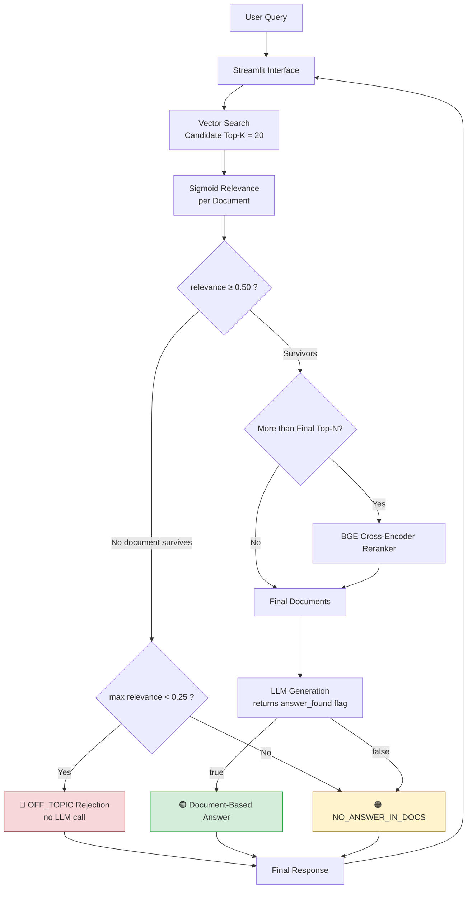

# AI-Driven OLED Assistant


An intelligent, secure, and domain-specific RAG (Retrieval-Augmented Generation) assistant for OLED display engineers.

## Overview
This tool allows engineers to ask technical questions about OLED physics, fabrication, and materials. Its **Strict RAG** engine requires relevant document evidence before generation and returns "No Answer" when the corpus cannot support a response.

Retrieved documents are the **primary source**. When they contain partial but relevant evidence, the model may connect missing logical steps using OLED/physics knowledge, but it may not invent unsupported numbers, experimental conditions, or citations.

### Key Features
- **Strict Document-Grounded RAG**: The system has no unrestricted LLM fallback. It rejects off-topic questions before generation and returns `NO_ANSWER_IN_DOCS` when retrieved evidence is insufficient.
- **Public Cloud Demo**: The current application runs on Google Cloud Run and uses **GPT-5-mini** through the OpenAI API. `reasoning_effort="minimal"` keeps document-grounded generation responsive.
- **Privacy-First Internal Track**: The original internal deployment used **Mistral-Nemo via Ollama** on local hardware so sensitive OLED documents did not leave the machine. This remains a separate deployment track, not the runtime used by the public demo in this repository.
- **Production-Style Vector DB Lifecycle**: In cloud deployment, the image ships with a prebuilt `chroma_db` for fast startup. The app only rebuilds from `data/` when the DB is missing or incompatible.
- **Wide Retrieval + BGE Reranking**: Retrieves a wider candidate pool, filters it by a per-document relevance threshold, then uses a `BAAI/bge-reranker-base` cross-encoder to select the strongest final documents for the LLM.
- **Measured, Not Guessed, Thresholds**: `scripts/measure_relevance_distribution.py` dumps the relevance distribution of every retrieved candidate across representative queries, so decision thresholds come from observed separation between on-topic and off-topic questions.
- **Validated Local-Model Track**: Historical experiments found that the optimized Mistral-Nemo internal track produced domain-answer quality comparable to GPT-4o-mini for the evaluated OLED question set.

---

## Screenshots

| RAG Mode - Document-based Answer |
|:---:|
|  |

*The assistant provides detailed, document-grounded answers with relevance scores and response times.*

---

## Key Motivation

### Why Strict RAG?

This tool is designed for **PhD-level domain experts** who need precise, actionable answers—not generic information they could find on Google.

| Standard RAG | Strict RAG (This Tool) |
|--------------|------------------------|
| May answer even when retrieval evidence is weak | Requires at least one document to pass the relevance filter |
| May use broad model knowledge as the answer source | Uses retrieved documents as the primary source and permits only limited logical completion |
| Can produce a plausible answer despite a corpus gap | Returns `NO_ANSWER_IN_DOCS` when the context does not support an answer |

**Why "No Answer" is better than LLM Fallback:**
- If information is not supported by the corpus, the system should expose that coverage gap.
- Returning a "plausible guess" from LLM knowledge would be **dangerous in production** settings.
- Engineers need to know when something is missing so they can **identify it as a next step** in their actual work.
- Generic answers from news/blog or Wikipedia are **not what experts need**—they can Google that themselves.

> **Design Philosophy**: Retrieved technical evidence must exist before the model is allowed to answer. Limited domain reasoning may connect that evidence, but it cannot replace missing evidence.

---

### On-Premise LLM vs Commercial API

This project was originally built and operated as an **Apple-internal, on-premise
OLED assistant**. Sensitive technical documents and inference stayed on local
hardware, with Mistral-Nemo served through Ollama. The internal production data,
vector database, and deployment code cannot be published, so they are not
included in this public repository.

The public repository provides a separate, deployable demonstration of the same
RAG design:

| Track | Current public demo | Internal privacy-first deployment |
|-------|---------------------|-----------------------------------|
| LLM | GPT-5-mini via OpenAI API | Mistral-Nemo via Ollama |
| Runtime | Google Cloud Run | Local/on-premise hardware |
| Data | Publicly deployable OLED corpus and prebuilt ChromaDB | Sensitive internal OLED documents |
| Goal | Reproducible public demonstration | Keep Apple-internal documents and inference fully local |

The current code in `src/rag_engine.py` implements the **public cloud track**
with `ChatOpenAI`. Non-confidential notebooks and evaluation artifacts document
the Mistral-Nemo experiments, but the Apple-internal implementation and data are
intentionally excluded.

An earlier project version directly compared the on-premise Mistral-Nemo system
with the commercial GPT-4o-mini API on the same OLED evaluation set:

| Aspect | Commercial baseline (GPT-4o-mini) | On-premise system (Mistral-Nemo) |
|--------|------------------------------------|----------------------------------|
| Serving | Cloud API | Local Ollama inference |
| Data privacy | Documents leave the local environment when sent as context | Documents and inference remain local |
| Usage cost | Pay per token | No per-token API charge |
| Evaluated answer quality | Strong commercial baseline | Comparable after domain-specific optimization |

This comparison produced an important engineering finding:

> **With proper optimization, on-premise LLMs can achieve commercial-tool-level performance for a constrained domain task.**

**How the local track was optimized:**
1. **Prompt Optimization**: Carefully engineered prompts for domain-specific responses
2. **High-Quality RAG Data**: Curated internal technical documents
3. **Hyperparameter Tuning**: Systematic experiments to find optimal settings (chunk size, relevance threshold, etc.)

In the evaluated OLED question set, PhD-level experts found the optimized Mistral responses comparable in quality to GPT-4o-mini.

> **Note**: This doesn't mean Mistral is "better" than GPT—it means that with the right optimization, you can achieve production-grade results with local, private infrastructure.

---

## Tech Stack


### Architecture Choices
- **App Interface**: `Streamlit` was chosen for rapid prototyping and its native support for chat interfaces (`st.chat_message`).
- **LLM Serving (Current Public App)**: `ChatOpenAI` serves **GPT-5-mini** through the OpenAI API on Google Cloud Run. GPT-5 uses its required temperature (`1.0`) with `reasoning_effort="minimal"`.
- **LLM Serving (Internal Track)**: The privacy-first internal deployment uses **Mistral-Nemo 12B via Ollama** on local hardware; it is documented as a separate deployment path.
- **RAG Orchestration**: Custom retrieval logic performs wide vector search, sigmoid relevance scoring, per-document filtering, and BGE cross-encoder reranking before answer generation.
- **Modular Data Pipeline**: `src/document_pipeline.py` isolates document loading, chunking, embedding, and ChromaDB lifecycle management from `src/rag_engine.py`.
- **Vector Database**: `ChromaDB` is prebuilt into the cloud image for low cold-start latency, then reused at runtime ("rebuild only if missing/incompatible").
- **Container Orchestration**: The same Docker image also runs on Kubernetes (`k8s/oled-assistant.yaml`): a Deployment with resource requests/limits and readiness/liveness probes, a Service for access, and the API key injected from a Kubernetes Secret.

---

## System Architecture

The system follows **Strict RAG** logic with a modern retrieval pipeline: it first retrieves a wider candidate pool, filters weak matches, reranks the survivors, and answers only from the strongest final documents.


```mermaid
graph TD
    User[User Query] --> UI[Streamlit Interface]
    UI --> VectorSearch[Vector Search<br/>Candidate Top-K = 20]
    VectorSearch --> Score[Sigmoid Relevance<br/>per Document]
    Score --> Filter{relevance ≥ 0.50 ?}

    Filter -->|No document survives| Gate{max relevance < 0.25 ?}
    Gate -->|Yes| Reject[🔴 OFF_TOPIC Rejection<br/>no LLM call]
    Gate -->|No| NoAnswer[🟠 NO_ANSWER_IN_DOCS]

    Filter -->|Survivors| Rerank{More than Final Top-N?}
    Rerank -->|Yes| CrossEncoder[BGE Cross-Encoder Reranker]
    Rerank -->|No| FinalDocs[Final Documents]
    CrossEncoder --> FinalDocs

    FinalDocs --> LLM[LLM Generation<br/>returns answer_found flag]
    LLM -->|true| Answer[🟢 Document-Based Answer]
    LLM -->|false| NoAnswer

    Reject --> Final[Final Response]
    Answer --> Final
    NoAnswer --> Final
    Final --> UI

    style Answer fill:#d4edda,stroke:#28a745
    style NoAnswer fill:#fff3cd,stroke:#856404
    style Reject fill:#f8d7da,stroke:#721c24
```

**Key Decision Points:**
- **One score, one scale**: every threshold is compared against `relevance = sigmoid(cosine similarity)`. Raw similarity is only ever the sigmoid's input, because scientific text clusters too tightly in raw space to threshold reliably
- **Candidate Top-K (20)**: Retrieves a wider pool first to reduce missed relevant chunks
- **Document Filter (0.50)**: The one knob controlling answer quality. Documents below it never reach the reranker or the LLM
- **Final Top-N (4)**: Sends only the strongest reranked documents to the LLM
- **Off-Topic Gate (0.25)**: Deliberately loose. It runs only when *no* document survives the filter, and merely picks which rejection the user sees. Measured on this corpus, off-topic queries peak at 0.044 while on-topic queries start at 0.635
- **Grounding Check**: The LLM reports whether the context supported an answer through an explicit `answer_found` flag in its JSON response, so no second scoring call is needed

---

## Quick Start

### Option 1: Try Live Demo (Cloud Deployment)

**No installation required!** Access the deployed application directly:

**[https://oled-assistant-961016411722.us-west2.run.app](https://oled-assistant-961016411722.us-west2.run.app)**

> Deployed on Google Cloud Run for instant access.

### Option 2: Run with Docker

The easiest way to run the application with minimal local setup.

```bash
# 1) Build image
docker build -t oled-assistant .

# 2) Run container
docker run -p 8502:8501 -e OPENAI_API_KEY="your-api-key-here" oled-assistant
```

Visit `http://localhost:8502` in your browser.

### Option 3: Run Locally (Code-Only Clone)

1. **Clone the repository**
   ```bash
   git clone https://github.com/ChangYeongJeong1103/oled-assistant.git
   cd oled-assistant
   ```

2. **Install dependencies**
   ```bash
   pip install -r requirements.txt
   ```

3. **Set up environment**
   Create a `.env` file in the root:
   ```env
   OPENAI_API_KEY=sk-...
   ```

4. **Prepare runtime data (required)**
   This GitHub repository is code-only by default (both `data/` and `chroma_db/` are excluded).
   To run locally, provide one of the following:
   - a prebuilt `chroma_db/` folder, or
   - source files (`.pdf` / `.docx`) under `data/` and then build `chroma_db/`.

5. **Run the app**
   ```bash
   streamlit run src/app.py
   ```

### Option 4: Run on Kubernetes (Local Cluster)

Runs the same Docker image on a local Kubernetes cluster (tested with Docker Desktop's built-in kubeadm cluster). `k8s/oled-assistant.yaml` defines a Deployment (versioned image tag, `Recreate` update strategy, resource requests/limits, readiness and liveness probes) and a LoadBalancer Service.

**Prerequisites**: Docker Desktop with Kubernetes enabled (Settings → Kubernetes), about 8 GB of memory allocated to Docker, and a prebuilt `chroma_db/` folder (see Option 3, step 4).

1. **Create a key-only env file** named `.env.k8s` in the root (git-ignored). Keep only the key the app needs, because every line becomes part of the Secret:
   ```env
   OPENAI_API_KEY=sk-...
   ```

2. **Build, store the key, and deploy**
   ```bash
   # 1) Build image (the tag must match the image name in the manifest)
   docker build -t oled-assistant:v1 .

   # 2) Store the API key as a Kubernetes Secret (never written into the manifest)
   kubectl create secret generic openai-secret --from-env-file=.env.k8s

   # 3) Deploy and wait until the pod is ready
   kubectl apply -f k8s/oled-assistant.yaml
   kubectl rollout status deploy/oled-assistant
   ```

3. **Open** `http://localhost:8080` in your browser.

**Operations**
```bash
# Stop / start the app without deleting its configuration
kubectl scale deploy/oled-assistant --replicas=0
kubectl scale deploy/oled-assistant --replicas=1

# Release a new version: build a new tag, update "image:" in the manifest, then apply
docker build -t oled-assistant:v2 .
kubectl apply -f k8s/oled-assistant.yaml

# Roll back to the previous version (the old image tag must still exist)
kubectl rollout undo deploy/oled-assistant
kubectl rollout history deploy/oled-assistant

# Remove everything
kubectl delete -f k8s/oled-assistant.yaml
kubectl delete secret openai-secret
```

**Known limitations of this local setup**
- **Readiness**: The probe checks that the Streamlit server responds, not that the embedding model, reranker, and ChromaDB are loaded.
- **First question**: Models load on first use, so the first response is slower than later ones.
- **Session**: Chat history lives in the pod's memory and is lost when the pod is replaced.
- **Downtime on update**: `Recreate` stops the old pod before starting the new one (about 20 s of downtime), because two 4Gi pods do not fit on an ~8 GB single node.

**Verified on Docker Desktop (single node, ~8 GB)**
- All three modes are unchanged: OLED questions return `RAG`, a cooking question returns `OFF_TOPIC` without an LLM call, and questions about patents or supply-chain cost return `NO_ANSWER_IN_DOCS`.
- Self-healing: after deleting the pod, the Deployment created a replacement within 1 s and the app was healthy again in 22 s.
- Update and rollback: `v1 → v2` through the manifest and `v2 → v1` through `kubectl rollout undo` each finished in about 23 s, confirmed by the running image ID.
- Latency: model and vector DB loading took about 10 s; the first question took about 12.5 s and later questions about 3.5–9 s.

> With `kind` or `minikube`, load the local image into the cluster first (e.g. `kind load docker-image oled-assistant:v1`).

---

## Project Structure

```text
oled-assistant/
├── src/                  # Source Code
│   ├── __init__.py       # Package marker
│   ├── app.py            # Main Streamlit Application
│   ├── rag_engine.py     # Strict RAG Logic Class
│   ├── document_pipeline.py # Document loading/chunking/vector DB lifecycle
│   ├── config.py         # Configuration & Hyperparameters
│   └── utils.py          # Logging & Helper Functions
├── scripts/              # Tuning & Validation Utilities
│   └── measure_relevance_distribution.py  # Relevance distribution measurement
├── data/                 # Optional local-only source docs for rebuilding vector DB
├── notebooks/            # Development Notebooks
│   ├── OLED_assistant_v1_HP_tuning.ipynb  # Hyperparameter tuning
│   ├── OLED_assistant_v2_Mistral.ipynb    # Mistral integration
│   ├── OLED_assistant_v3_final.ipynb      # Strict RAG baseline
│   ├── OLED_assistant_v4_sim.ipynb        # Simulation and validation notebook
│   ├── OLED_assistant_v5_updated.ipynb    # Updated modular validation notebook
│   └── OLED_Assistant_v6_GCP.ipynb        # Cloud deployment validation notebook
├── chroma_db/            # Prebuilt persistent vector DB (cloud image includes this folder)
├── docs/                 # Documentation & Experiments
│   ├── architecture.md   # System Flowchart
│   ├── rag_engine.md     # Logic Explanation
│   ├── hyperparameter.md # Hyperparameter Tuning Guide
│   ├── llm_comparison.md # LLM Comparison Results
│   └── experiments/      # Research Data (logs, CSVs)
├── k8s/                  # Kubernetes Manifests
│   └── oled-assistant.yaml  # Deployment + Service
├── logs/                 # Usage Logs
├── screenshot/           # Demo Screenshots
├── requirements.txt      # Python Dependencies
└── README.md             # This file
```

## Documentation
- [System Architecture](docs/architecture.md)
- [RAG Engine Logic](docs/rag_engine.md)
- [Hyperparameter Tuning](docs/hyperparameter.md)
- [LLM Comparison](docs/llm_comparison.md)

## Future Work

### LLM Fine-Tuning (Next Phase)

- **Goal**: Build an OLED-specialized Mistral that natively understands domain terminology
- **Expected Benefits**: Faster responses, better consistency, reduced prompt complexity
- **Approach**: QLoRA fine-tuning with 500+ expert-validated Q&A pairs from internal documents

---
**Developed by CYJ for XF Team**
