# AI-Driven OLED Assistant


An intelligent, secure, and domain-specific RAG (Retrieval-Augmented Generation) assistant for OLED display engineers.

## Overview
This tool allows engineers to ask technical questions about OLED physics, fabrication, and materials. It uses a **Strict RAG** engine to ensure that all answers are derived *exclusively* from internal technical documents, eliminating hallucinations.

### Key Features
- **Strict RAG for Experts**: Designed for PhD-level engineers. It answers **ONLY** using verified internal technical documents, strictly avoiding generic internet-based knowledge (blogs, Wikipedia) to ensure high-precision insights that Google cannot provide.
- **Secure & Local**: Runs entirely on your machine using **Mistral-Nemo** via Ollama. No data leaves the laptop.
- **Production-Style Vector DB Lifecycle**: In cloud deployment, the image ships with a prebuilt `chroma_db` for fast startup. The app only rebuilds from `data/` when the DB is missing or incompatible.
- **Commercial-Grade Accuracy on Local Hardware**: Through rigorous prompt optimization and hyperparameter tuning, we achieved answer quality comparable to cloud-based commercial models (GPT-4o-mini), validated by PhD-level experts.

---

## Screenshots

| RAG Mode - Document-based Answer | Multi-turn Conversation |
|:---:|:---:|
|  |  |

*The assistant provides detailed, document-grounded answers with relevance scores and response times.*

---

## Key Motivation

### Why Strict RAG? (No LLM Fallback)

This tool is designed for **PhD-level domain experts** who need precise, actionable answers—not generic information they could find on Google.

| Standard RAG | Strict RAG (This Tool) |
|--------------|------------------------|
| Falls back to LLM knowledge if documents lack info | Returns "No Answer" if documents lack info |
| May include news/Wikipedia-level knowledge | Answers **only** from verified internal documents |
| Risk of plausible but non-professional answers | Guarantees every answer is traceable to source |

**Why "No Answer" is better than LLM Fallback:**
- If information isn't in our documents, it means **the work hasn't been done yet**.
- Returning a "plausible guess" from LLM knowledge would be **dangerous in production** settings.
- Engineers need to know when something is missing so they can **identify it as a next step** in their actual work.
- Generic answers from news/blog or Wikipedia are **not what experts need**—they can Google that themselves.

> **Design Philosophy**: This is a tool for practitioners who need answers grounded in real internal data, not speculation.

---

### On-Premise LLM vs Commercial API

A key finding from this project:

> **With proper optimization, on-premise LLMs can achieve commercial-tool-level performance.**

| Aspect | Commercial (GPT-4o) | On-Premise (Mistral-Nemo) |
|--------|---------------------|---------------------------|
| Native capability | Higher | Medium |
| Latency | Network-dependent | Faster (local) |
| Data privacy | Cloud-based | 100% local |
| Cost | Pay-per-token | Free |
| **Optimized performance** | Best with optimization | **Comparable** with optimization |

**How we achieved this:**
1. **Prompt Optimization**: Carefully engineered prompts for domain-specific responses
2. **High-Quality RAG Data**: Curated internal technical documents
3. **Hyperparameter Tuning**: Systematic experiments to find optimal settings (chunk size, relevance threshold, etc.)

The result: PhD-level experts validated that the optimized Mistral responses are **indistinguishable in quality** from GPT-4o-mini for our domain-specific use case.

> **Note**: This doesn't mean Mistral is "better" than GPT—it means that with the right optimization, you can achieve production-grade results with local, private infrastructure.

---

## Tech Stack


### Architecture Choices
- **App Interface**: `Streamlit` was chosen for rapid prototyping and its native support for chat interfaces (`st.chat_message`).
- **LLM Serving**: `Ollama` enables **Mistral-Nemo 12B** to run locally, ensuring **100% data privacy** for sensitive OLED technical documents.
- **RAG Orchestration**: `LangChain` provides the RAG chain (`RetrievalQA`) for document retrieval and answer generation, while custom sigmoid-based relevance scoring handles strict filtering.
- **Modular Data Pipeline**: `src/document_pipeline.py` isolates document loading, chunking, embedding, and ChromaDB lifecycle management from `src/rag_engine.py`.
- **Vector Database**: `ChromaDB` is prebuilt into the cloud image for low cold-start latency, then reused at runtime ("rebuild only if missing/incompatible").

---

## System Architecture

The system follows **Strict RAG** logic: queries are first scored for relevance, then answered only from documents.

```mermaid
graph TD
    User[User Query] --> UI[Streamlit Interface]
    UI --> Scorer{Relevance Score}
    
    Scorer -->|"≥ 0.60"| RAG[🟢 RAG Mode]
    Scorer -->|"< 0.60"| Reject[🔴 OFF_TOPIC Rejection]
    
    RAG --> Check{Answer Found<br/>in Documents?}
    
    Check -->|Yes| Answer[🟢 Document-Based Answer]
    Check -->|No| NoAnswer[🟠 NO_ANSWER_IN_DOCS]
    
    Reject --> Final[Final Response]
    Answer --> Final
    NoAnswer --> Final
    Final --> UI
    
    style RAG fill:#d4edda,stroke:#28a745
    style Answer fill:#d4edda,stroke:#28a745
    style NoAnswer fill:#fff3cd,stroke:#856404
    style Reject fill:#f8d7da,stroke:#721c24
```



**Key Decision Points:**
- **Relevance Threshold (0.60)**: Queries below this are automatically rejected as off-topic
- **Document Check**: Even high-relevance queries may return "No Answer" if documents lack the specific information

---

## Quick Start

### Option 1: Try Live Demo (Cloud Deployment)

**No installation required!** Access the deployed application directly:

**[https://oled-assistant-961016411722.us-west2.run.app](https://oled-assistant-961016411722.us-west2.run.app)**

> Deployed on Google Cloud Run for instant access.

### Option 2: Run with Docker

The easiest way to run the application with minimal local setup.

```bash
# 1) Build image
docker build -t oled-assistant .

# 2) Run container
docker run -p 8502:8501 -e OPENAI_API_KEY="your-api-key-here" oled-assistant
```

Visit `http://localhost:8502` in your browser.

### Option 3: Run Locally (Code-Only Clone)

1. **Clone the repository**
   ```bash
   git clone https://github.com/ChangYeongJeong1103/oled-assistant.git
   cd oled-assistant
   ```

2. **Install dependencies**
   ```bash
   pip install -r requirements.txt
   ```

3. **Set up environment**
   Create a `.env` file in the root:
   ```env
   OPENAI_API_KEY=sk-...
   ```

4. **Prepare runtime data (required)**
   This GitHub repository is code-only by default (both `data/` and `chroma_db/` are excluded).
   To run locally, provide one of the following:
   - a prebuilt `chroma_db/` folder, or
   - source files (`.pdf` / `.docx`) under `data/` and then build `chroma_db/`.

5. **Run the app**
   ```bash
   streamlit run src/app.py
   ```

---

## Project Structure

```text
oled-assistant/
├── src/                  # Source Code
│   ├── __init__.py       # Package marker
│   ├── app.py            # Main Streamlit Application
│   ├── rag_engine.py     # Strict RAG Logic Class
│   ├── document_pipeline.py # Document loading/chunking/vector DB lifecycle
│   ├── config.py         # Configuration & Hyperparameters
│   └── utils.py          # Logging & Helper Functions
├── data/                 # Optional local-only source docs for rebuilding vector DB
├── notebooks/            # Development Notebooks
│   ├── OLED_assistant_v1_HP_tuning.ipynb  # Hyperparameter tuning
│   ├── OLED_assistant_v2_Mistral.ipynb    # Mistral integration
│   ├── OLED_assistant_v3_final.ipynb      # Strict RAG baseline
│   ├── OLED_assistant_v4_sim.ipynb        # Simulation and validation notebook
│   ├── OLED_assistant_v5_updated.ipynb    # Updated modular validation notebook
│   └── OLED_Assistant_v6_GCP.ipynb        # Cloud deployment validation notebook
├── chroma_db/            # Prebuilt persistent vector DB (cloud image includes this folder)
├── docs/                 # Documentation & Experiments
│   ├── architecture.md   # System Flowchart
│   ├── rag_engine.md     # Logic Explanation
│   ├── hyperparameter.md # Hyperparameter Tuning Guide
│   ├── llm_comparison.md # LLM Comparison Results
│   └── experiments/      # Research Data (logs, CSVs)
├── logs/                 # Usage Logs
├── screenshot/           # Demo Screenshots
├── requirements.txt      # Python Dependencies
└── README.md             # This file
```

## Documentation
- [System Architecture](docs/architecture.md)
- [RAG Engine Logic](docs/rag_engine.md)
- [Hyperparameter Tuning](docs/hyperparameter.md)
- [LLM Comparison](docs/llm_comparison.md)

## Future Work

### LLM Fine-Tuning (Next Phase)

- **Goal**: Build an OLED-specialized Mistral that natively understands domain terminology
- **Expected Benefits**: Faster responses, better consistency, reduced prompt complexity
- **Approach**: QLoRA fine-tuning with 500+ expert-validated Q&A pairs from internal documents

---
**Developed by CYJ for XF Team**
