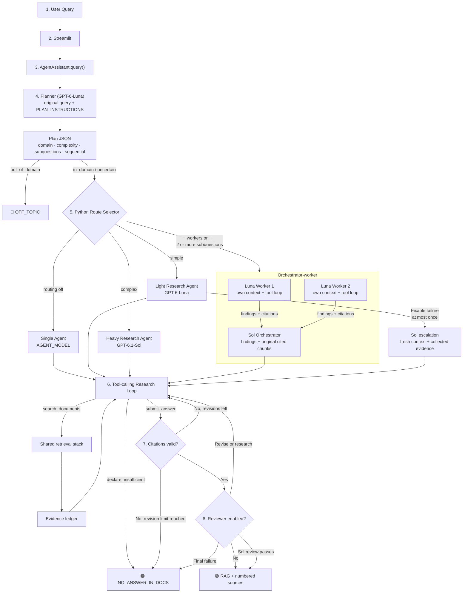

# Agent Engine

The OLED Assistant answers every question with an agent. It plans, searches the documents, searches again when needed, and decides by itself when to stop. It only answers from chunks it cited, and every limit is enforced in Python.

On top of the single agent we added three patterns that can be switched on or off with environment variables: **model routing** (a light and a heavy model, with one escalation), **orchestrator-worker**, and a **reviewer**. Each one was measured against the single agent. Based on those results, parallel tool calling, routing, workers, and the reviewer are all on by default.

## Why an agent

A single retrieval of the user's literal question is fragile. A typo ("how does thermaly activted delayed florescence work") or a short, informal question ("why do blue OLEDs die so fast?") can score below the document filter even though the documents cover it, and a question with two parts may need two different searches.

Lowering the threshold would only let weaker documents through, so we kept the relevance filter strict and let the agent decide _how_ to search instead. It rewrites the query (typos, abbreviations), splits multi-part questions, and searches again when the results are weak.

## Modules

| File | Role |
| :-- | :-- |
| `src/agent_runtime.py` | Per-request state and budgets, planner, routing and escalation, the shared tool loop, result format |
| `src/agent_team.py` | Orchestrator-worker and reviewer |
| `src/agent_prompts.py` | All prompts and tool schemas |
| `src/agent_tools.py` | `search_documents`, evidence ledger, citation and findings checks |
| `src/retrieval.py` | The retrieval stack behind `search_documents`: ChromaDB, relevance filter, reranker ([Retrieval](retrieval.md)) |

All model calls go through the OpenAI **Responses API**. GPT-6 models do not accept function tools together with reasoning in Chat Completions, while the Responses API supports both. We send every request with `store=False` and pass the encrypted reasoning items back on the next turn ourselves.

## Request flow



The plan is created inside the application; the user does not provide it. `AgentAssistant.query()` passes the original user query and the planner instructions to `self.light_model`. Under the current defaults, that model is GPT-6-Luna. Luna returns the structured JSON plan, Python validates and normalizes it, and `_choose_route()` selects the next role. The planner does not retrieve documents and does not write the answer.

**Answer policy.** We return `RAG` only when the cited evidence answers the **core** of the question, meaning the specific fact, figure, comparison, or mechanism that was asked for. If the evidence only touches related topics, the writer has to call `declare_insufficient`, which ends as `NO_ANSWER_IN_DOCS`. There is no partial-answer mode. A missing secondary detail can still be mentioned inside a `RAG` answer. Also, an agent only ever sees what its own searches returned, so it is not allowed to say that "the documents" lack something. It may only say that the retrieved evidence does not state it.

Every agent in the diagram runs the same tool loop (`AgentAssistant.research`). What changes between them is the instructions, the model, which "finish" tools they get, and what the finish handler does with the result.

### 1. Planning

Planning is the first LLM call of every request:

1. Streamlit passes the user's original text to `AgentAssistant.query(question)`.
2. `query()` creates a new per-request `AgentRun`, then calls `_plan(run)`.
3. `_plan()` calls the light model with two inputs: `PLAN_INSTRUCTIONS` as the developer message and the untouched user query as the user message. With the current defaults, the light model is GPT-6-Luna.
4. Luna fixes search-oriented wording such as typos and abbreviations, decides whether the question belongs to the OLED domain, estimates its complexity, and returns one to three search-ready subquestions. It does not search yet.
5. Python parses the JSON, limits it to three subquestions, supplies safe defaults if fields are missing, and stores the result in `run.plan`.

The structured output has this shape:

```json
{
  "domain": "in_domain | out_of_domain | uncertain",
  "reason": "one sentence",
  "complexity": "simple | complex",
  "subquestions": ["search-ready rewrite", "..."],
  "sequential": false
}
```

Only a clear `out_of_domain` ends the run here (`OFF_TOPIC`). We still search `uncertain` questions, so an oddly phrased OLED question is never rejected before we have looked at the documents. `sequential` marks a plan in which a later search needs the result of an earlier one.

Python—not Luna—makes the final routing decision from this plan, in the following order:

1. If workers are enabled and the plan has at least two subquestions, use the orchestrator-worker team. `sequential=true` makes those workers run in order; otherwise they run concurrently.
2. Otherwise, if model routing is disabled, use `AGENT_MODEL` for the single research agent.
3. Otherwise, send `simple` to Luna and `complex` to Sol.

For example, a question asking both which host material a device uses and that host's triplet energy may become two subquestions with `sequential=true`: first identify the host, then search for the identified material's triplet energy. With the default two workers, Python selects the team route and runs the second worker after the first worker's finding is available.

### 2. Tools

| Tool | Who gets it | What Python does |
| :-- | :-- | :-- |
| `search_documents(query)` | every role | Calls the Retriever's `retrieve_candidates → filter_candidates_by_relevance → rerank_candidates`. Returns `status`, `max_relevance`, and up to 4 chunks (`chunk_id`, title, page, relevance, text). |
| `submit_answer(answer, citations)` | answer writers | Citation check (below), then the reviewer if it is enabled. |
| `submit_findings(findings, citations)` | workers | Every cited ID must be in the ledger. Inline markers are optional, because findings are notes for the orchestrator. |
| `declare_insufficient(missing)` | everyone | Writer: stop with `NO_ANSWER_IN_DOCS`. Worker: report "insufficient" to the orchestrator. |

The model only chooses the query. `MIN_DOC_RELEVANCE`, `CANDIDATE_TOP_K`, and `FINAL_TOP_N` come from config, so the agent has no way to lower the threshold or skip the filter.

### 3. Parallel tool calling (`AGENT_PARALLEL_SEARCH`, default on)

In one turn the model may issue several `search_documents` calls, e.g. one per plan item. The finishing tools have to be called alone, so the model never submits an answer in the same turn it searches. Retrieval runs on the local CPU (bge-m3 + reranker), which means the searches themselves still run one after another. What we save is LLM turns.

### 4. Evidence ledger and citation check

Every chunk returned by a search is stored per request as `ledger[chunk_id] = {text, source, page, ...}`. The ID is a hash of the file name, page, and text, so the same chunk keeps the same ID across searches. The ledger, the search cache, and the budgets are shared by every agent working on the question.

Each agent context also keeps its own "seen" set. A chunk this context has already received comes back as a short reference. A chunk that **another** agent found earlier is sent in full, because this context has never seen its text. If another agent already ran the same query, we answer it from the cache without spending a search. The cache key only collapses whitespace. We keep signs, decimal points, and case, because "-5 V" and "+5 V" are different questions.

`submit_answer` is checked in this order:

1. Is there at least one citation?
2. Is every cited ID (in the list and inline in the text) in **this request's** ledger?
3. Is the answer well formed: non-empty, within the length limit, and citing inline as `[chunk_id]`?

When a submission is rejected, we send back the errors together with the list of IDs the model is allowed to cite (models occasionally miscopy an 8-hex ID). This check proves that the model only cites evidence it was actually shown. Whether each claim is supported is the job of the reviewer (optional) and of the evaluation judge.

### 5. Model routing and escalation (`AGENT_ROUTING`)

- `simple` questions go to the light model (GPT-6-Luna) and `complex` ones to the heavy model (GPT-6.1-Sol).
- If a light run fails in a way a stronger model could fix, it escalates to the heavy model **once**. That covers: citation revisions used up, the loop ran out of turns, the reviewer rejected the answer, or "insufficient evidence" even though retrieval scored ≥ `AGENT_ESCALATE_MIN_RELEVANCE` (0.70). Out-of-domain questions, API errors, and the deadline never escalate.
- The heavy run starts in a **fresh context** with the question, the plan, and the original text of every chunk collected so far. It does not inherit the light model's conversation. The search cache, ledger, and budgets are shared.

Note that this is routing rather than multi-agent work: only one agent is answering at any time.

### 6. Orchestrator-worker (`AGENT_WORKERS=2`)

We use this when the plan has 2+ sub-questions; otherwise the request is routed as above.

- Sub-questions are split into contiguous groups, one per worker, so that dependent hops keep their order.
- Each worker (light model) has its own context and tool loop and returns `submit_findings` (notes + chunk IDs) or "insufficient". A worker that runs out of turns is reported as failed, and the orchestrator decides with what the other workers found.
- Independent sub-questions run in parallel threads. If the plan is `sequential`, the workers run in order and each one sees the earlier findings.
- The orchestrator (heavy model) receives the worker reports **and the original text of every cited chunk**, checks the findings against it, may search for a specific gap while searches remain, and writes the answer with `submit_answer` (or calls `declare_insufficient` if the core of the question is not covered).

### 7. Reviewer (`AGENT_REVIEWER`)

The reviewer runs after a citation-valid `submit_answer` and uses the heavy model.

- **Input**: the question, the answer, and the full text of the cited chunks. It does **not** get the research trace, so it reads the answer the way a user would.
- **Output** (JSON schema): one entry per claim with `supported`, a suggested fix (`delete` / `research`), and `core_question_answered`. Statements about what the documents do or do not contain also count as claims. "The documents do not give X" is unsupported, since the reviewer only sees the cited chunks, while "the retrieved evidence does not give X" is something it can check. An unscoped statement such as "X is not established" is also unsupported.
- **Approval**: we accept the answer only if the review is readable, the core question is answered, and no claim is unsupported. If the review cannot be parsed or its claim list is empty, we treat it as a rejection.
- **Revision**: otherwise the review goes back to the writer as the tool result, and the writer deletes or re-searches the unsupported claims, or searches for the missing core information. Every revised answer is reviewed again, for at most `AGENT_MAX_REVIEW_ROUNDS` (2) revisions.
- **Final round**: if the last review still fails, the run stops with `review_failed`, which the user sees as `NO_ANSWER_IN_DOCS`.

### 8. Source registry

`src/source_registry.json` maps each source file to its paper title and a DOI link that we verified against Crossref (`scripts/build_source_registry.py`). It is attached when the answer is displayed, so ChromaDB did not have to be rebuilt. The model never writes titles or URLs itself.

## Configuration

| Variable | Default | Meaning |
| :-- | :-- | :-- |
| `AGENT_MODEL` | `gpt-6-luna` | Model for every role when routing is off |
| `AGENT_LIGHT_MODEL` / `AGENT_HEAVY_MODEL` | `gpt-6-luna` / `gpt-6.1-sol` | Models when routing is on (planner and workers use light; orchestrator and reviewer use heavy) |
| `AGENT_PARALLEL_SEARCH` | `true` | Allow several searches in one turn |
| `AGENT_ROUTING` | `true` | Complexity routing + one escalation (`false`: `AGENT_MODEL` for everything) |
| `AGENT_WORKERS` | `2` | Orchestrator-worker for 2+ sub-questions (`0`: single agent) |
| `AGENT_REVIEWER` | `true` | Claim-level review before an answer is accepted |
| `AGENT_REASONING_EFFORT` | per model (`low` for GPT-6) | Override for every model |
| `AGENT_API_RETRIES` | `1` | Retries for transient API errors, within the deadline |

We picked the defaults from the evaluation below. The cheapest setup (Luna only) is `AGENT_ROUTING=false AGENT_WORKERS=0 AGENT_REVIEWER=false`.

## Limits enforced in Python

All limits apply per user question and are shared by every agent working on it.

| Limit | Default | When reached |
| :-- | :-- | :-- |
| LLM calls (all roles) | 6, +4 routing, +6 workers, +3 reviewer | stop: `llm_budget_exhausted` |
| LLM calls per tool loop | 5 | that loop stops (a worker reports "failed") |
| Searches | 3 (4 with workers) | search tool removed from the tool list |
| Answer revisions after failed validation | 2 | stop: `revision_limit` |
| Reviewer revision rounds | 2 | final review decides RAG or `review_failed` |
| Wall-clock deadline | 90 s (150 s with routing, workers, or reviewer) | stop: `deadline_exceeded` |
| Timeout per API attempt | 60 s, capped by the time left | stop: `api_timeout` (`deadline_exceeded` if the deadline cut it short) |
| API retries | 1, for timeouts, connection errors, 429, and 5xx, only if the pause and the attempt fit in the time left | stop: `api_timeout` / `api_error` |
| Query / answer length | 300 / 6000 chars | error returned to the model |

- We check the deadline before every API attempt, before and after every search (searches wait for each other on the shared CPU), and right before the final answer is accepted. Retries are handled by our runtime instead of the SDK, so a retry can never run past the deadline.
- On the last call a loop is allowed to make, we take the search tool away, so the model has to submit (still validated) or declare insufficient evidence.
- When a limit is hit, the run simply stops. We never force an unverified answer.
- Plain-text replies, malformed arguments, and unknown tool names are returned to the model as errors, and they count against the LLM budget.

## Output

`AgentAssistant.query()` returns `answer`, `mode`, `relevance_score` (the best relevance seen in any search), and `retrieval_metadata`, plus:

- `sources`: a numbered list of the cited chunks with registry title, URL, and page
- `agent`: features, plan, route, escalation, worker reports, review rounds, trace (every event tagged with its role), stop reason, usage per model and per role, cost, and the cited evidence

| Stop reason | User-facing mode |
| :-- | :-- |
| `answered` | `RAG` |
| `out_of_domain` | `OFF_TOPIC` |
| `insufficient_evidence`, `llm_budget_exhausted`, `deadline_exceeded`, `revision_limit`, `review_failed` | `NO_ANSWER_IN_DOCS` |
| `api_error`, `api_timeout` | `ERROR` |

In the UI, the sidebar shows the active models and features, `st.status` shows live progress, and each answer gets numbered sources and an **Agent Trace** expander listing every step and the role that took it. Events from parallel workers are queued and shown once the workers finish, because Streamlit can only be updated from the main thread. The same trace is appended to `logs/agent_traces.jsonl`.

## Evaluation

`scripts/evaluate_agent.py` runs the agent on `eval/questions.json` (50 questions: normal, typo, paraphrase, abbreviation, ambiguous, easy, multi-hop, sequential, no-answer, and off-topic). An independent judge model splits each answer into claims and grades every claim against the chunks the agent cited. The feature flags are read from the environment, so the same command measures any configuration.

```bash
# inside the container, with the repo's src/scripts/eval mounted
python scripts/evaluate_agent.py --run --label final
AGENT_REVIEWER=false python scripts/evaluate_agent.py --run --label no_reviewer
python scripts/evaluate_agent.py --compare eval/results/A.json eval/results/B.json eval/results/C.json --out multi_agent.md
python scripts/evaluate_agent.py --rejudge eval/results/raw/A.json
```

`scripts/probe_corpus.py "query" ...` prints what the search tool returns. We used it to check every expected point in the eval set against real chunks.

Each run is saved twice. `eval/results/raw/` keeps the full result, including the text of every evidence chunk. That folder is git-ignored, because the source papers are not ours to republish. `eval/results/` gets the same result without the chunk text, and every citation can still be traced through its chunk ID, paper title, URL, and page. `--make-public FILE ...` converts older result files the same way and is safe to run more than once. `--rejudge FILE` applies the current judge policy to a saved raw result without running the agent again.

## Results: model routing and multi-agent patterns

We ran all 50 questions once per configuration and graded them with `gpt-5` (`eval/results/multi_agent_comparison.md`). Costs use the standard OpenAI rates in `config.MODEL_PRICING_PER_1M` (Luna $0.10 / $0.50, Sol $2.00 / $10.00 per 1M input / output tokens). The configurations were run one after another, because retrieval shares the same CPU and running them in parallel would skew latency.

NOTE: these runs used the answer policy from before the fixes described in [After the review fixes](#after-the-review-fixes). We kept the numbers exactly as measured. Their judge (`strict_absence_v1`) also treated statements about missing evidence more strictly than the final run's judge (`scoped_absence_v2`), so their rates are not directly comparable with the final run.

| Configuration | Mode acc. | False rej. | False acc. | Unsupported claims | Answers with ≥1 unsupported | Key points | LLM calls | Latency mean / p90 | Cost / question |
| :-- | :-: | :-: | :-: | :-: | :-: | :-: | :-: | :-: | :-: |
| Luna, one search per turn | 98% | 0% | 12.5% | 4.7% | 11 / 43 | 0.62 | 3.7 | 18.4 / 33.4 s | $0.0009 |
| Luna, parallel searches | 96% | 2.4% | 12.5% | 4.1% | 7 / 42 | 0.65 | 3.6 | 19.7 / 37.1 s | $0.0010 |
| Sol, parallel searches | 98% | 0% | 12.5% | 2.6% | 5 / 43 | 0.71 | 3.3 | 20.1 / 32.1 s | $0.0198 |
| Routing (Luna → Sol) | 98% | 0% | 12.5% | 3.8% | 9 / 43 | 0.64 | 3.5 | 16.8 / 30.3 s | $0.0107 |
| Routing + 2 workers | 98% | 0% | 12.5% | 3.2% | 8 / 43 | 0.65 | 5.0 | 18.2 / 31.3 s | $0.0057 |
| Routing + reviewer | 96% | 2.4% | 12.5% | 2.3% | 6 / 42 | 0.67 | 4.6 | 28.1 / 45.4 s | $0.0193 |

False rejection is measured over the 42 answerable questions, and false acceptance over the 8 questions that should be refused (4 not in the documents, 4 off-topic).

**False acceptance on `na1`.** Every agent configuration answered `na1` ("What is the supply-chain cost of phosphorescent OLEDs?") instead of refusing it, which is 1 of 8 (12.5%). The answers did not make up cost figures. For example, the reviewer configuration's answer had four claims. The two factual ones (the cost of noble metals is an obstacle; osmium, platinum, and iridium are named) were supported. The two unsupported ones said that the documents contain no quantified supply-chain cost and no monetary figures, which the agent could not know after reading only a few chunks. So the real mistake was answering at all: remarks about related costs are not the quantitative cost the user asked for. On this one answer, the unsupported-claim rate ranged from 12.5% to 57.1% across configurations. The fixes below address both problems. The agent now refuses when the core of the question is not answered, and it may only say that the retrieved evidence does not state something.

The same data, split by question type. "Hard" means the 13 multi-hop and sequential questions, and this set is the same in every configuration.

| Configuration | Hard: unsupported | Hard: cost | Routed `light`: unsupported / latency / cost | Routed `heavy` or `team`: unsupported / latency / cost |
| :-- | :-: | :-: | :-: | :-: |
| Luna, parallel | 7.1% | $0.0012 | – | – |
| Sol, parallel | 0.9% | $0.0278 | – | – |
| Routing | 2.8% | $0.0251 | 6.0% / 12.6 s / $0.0008 (27 runs) | heavy: 2.3% / 26.1 s / $0.0271 (19) |
| Routing + workers | 2.1% | $0.0116 | 4.7% / 12.0 s / $0.0010 (27) | team: 1.9% / 30.5 s / $0.0135 (19) |
| Routing + reviewer | 2.0% | $0.0404 | 2.7% / 24.5 s / $0.0072 (29) | heavy: 2.0% / 40.5 s / $0.0446 (17) |

IMPORTANT: the routed columns depend on how the planner labeled each question in that run, so different rows cover **different questions**. For example, the 19 `team` runs and the 19 `heavy` runs share only 17 questions. To compare configurations, use the "Hard" columns, which cover the same 13 questions everywhere.

### What each pattern did

**Parallel tool calling (kept on).** The model issued several searches in one turn in 19 of 50 runs, and it searched more overall (1.50 → 1.72 per question; 1.85 → 2.15 on hard questions). Answers with an unsupported claim dropped from 11 to 7. LLM calls barely changed (3.72 → 3.62), and latency did not go down, because the searches share one CPU and run one after another. We would expect the latency gain to show up with a remote vector store. One sequential question (`sq2`) was rejected in this run but answered in the others, so we read it as run-to-run variance.

**Routing (kept on).** The planner marked 19 of the 46 in-domain questions as `complex`. Compared with using Sol for everything, routing cut the cost by 46% ($0.0198 → $0.0107) and mean latency by 17%, while unsupported claims went from 2.6% to 3.8% (9 → 11 claims out of about 300). Compared with using Luna for everything, it cut unsupported claims on hard questions from 7.1% to 2.8% at about 10× the cost. The `light` route stayed as cheap and fast as Luna alone (12.6 s, $0.0008). Escalation fired once in the 83 light-routed runs across the three routing configurations (`na3`, an unanswerable question whose retrieval scored above 0.70; Sol declined it as well). So the trigger is safe, but on this corpus it is rarely needed.

**Orchestrator-worker (kept on).** We see this as a trade-off between Luna and Sol. On the same 13 hard questions:

| Configuration     | Unsupported claims | Cost / question |
| :---------------- | :----------------: | :-------------: |
| Luna only         |   7.1% (6 / 85)    |     $0.0012     |
| Routing + workers |   2.1% (2 / 97)    |     $0.0116     |
| Sol only          |   0.9% (1 / 111)   |     $0.0278     |

The team (two Luna workers + a Sol orchestrator) grounds its answers better than Luna at less than half of Sol's cost, because the many search turns run on Luna and Sol only makes 1–2 calls on condensed evidence. We cannot claim it is as good as Sol, though. Sol alone was still lower, and a single run of 13 questions cannot tell 2 unsupported claims apart from 1. We also dropped an earlier comparison of the team route (1.9%) with the routing run's heavy route (2.3%), since those two numbers come from different question sets. The cost of the team is about 2× the LLM calls (7.4 vs 3.5) and +4 s latency on the routed questions. Across all 50 questions, routing + workers was the cheapest configuration that beat Luna alone on unsupported claims, so it became our initial default.

**Reviewer (initially kept off).** Unsupported claims went down from 3.8% to 2.3% (answers with one: 9 → 6). The reviewer sent 7 of 43 answers back, and 6 of them passed after one revision. The seventh (`sq2`) turned into a **false rejection**: the reviewer rejected "FIrpic was the emitter" even though the cited chunk names a "doped (10 wt% FIrpic) emitting layer", and the writer gave up. The same question was answered correctly without the reviewer. The reviewer also let through several claims that the judge later marked unsupported, so the two models disagree at the margin. This run still used the earlier approval rule, which kept an answer with unsupported claims after the last round as long as the core question was answered (the current rule is in section 7). Paying +80% cost and +67% latency (p90 45 s) for 1.5 points fewer unsupported claims and one new false rejection did not seem worth it in this first comparison. The corrected reviewer and combined default are measured below.

**Caveats.** Each configuration ran once on 50 questions (13 of them hard), so differences of one or two claims are within run-to-run noise. Our corpus is also small and well covered. The internal version, with a larger and more complex document set, benefited more from routing and decomposition. The judge (`gpt-5`) is a different model from both the agents and the reviewer.

## After the review fixes

The first comparison showed the value of each pattern, but it also exposed two problems. The writer sometimes answered `na1` from related cost facts, and the reviewer could approve an answer after its last round even when a claim was still unsupported. We fixed both rules.

The evaluation itself also had a mismatch. The writer and reviewer correctly allow a scoped statement such as "the retrieved evidence does not state X", but the original judge (`strict_absence_v1`) sometimes marked that safe statement unsupported. We aligned the judge with the same rule (`scoped_absence_v2`) and added `--rejudge`, which grades a saved answer and its original evidence without running the agent again. Every result file in `eval/results/` records its `judge_policy`: the final run uses `scoped_absence_v2`, and all earlier runs use `strict_absence_v1`.

### How we chose the default

During development we repeated a few sensitive questions several times: `na1` (core-answer refusal), `sq2` (sequential retrieval), `mh1` (a causal bridge), and `mh5` (multi-hop optics). The workers made `sq2` retrieval more reliable, and the reviewer consistently refused `na1`. Using both kept the two advantages, so we chose the combined setup.

These tests also led to two general prompt rules: causal questions are split into the mechanism changed by A and the effect of that mechanism on B, and every absence statement has to name the retrieved or cited evidence explicitly.

NOTE: These development tests ran on intermediate versions before the final prompt changes, so we do not publish them as measured results. The measured result below comes from the frozen version evaluated before the agent-only refactor.

### Final 50-question run

After those prompt changes, we froze the code and evaluated routing + 2 workers + reviewer on all 50 questions, verifying identical SHA-256 hashes before and after the run. This configuration remains the default, but the current source includes a subsequent agent-only refactor. The results are published in `eval/results/agent_final_combined_20261004_035751.json` (judge policy: `scoped_absence_v2`).

| Mode acc. | False rej. | False acc. | Unsupported claims | Partially supported | Answers with ≥1 unsupported | Key points | LLM calls | Latency mean / p90 | Cost / question |
| :-: | :-: | :-: | :-: | :-: | :-: | :-: | :-: | :-: | :-: |
| **98%** (49 / 50) | 2.38% | **0%** | **0.35%** (1 / 289) | 2.77% (8 / 289) | **1 / 41** | 0.687 | 6.56 | 30.0 / 50.9 s | $0.0183 |

- **`na1`**: The agent refused it, so the earlier false acceptance is gone.
- **`sq2`**: This was the one mode error. The run did not retrieve a passage that directly connected FIrpic, 10 wt%, and the 34.1% EQE device, so the reviewer rejected the answer. Its retrieval is still sensitive to which chunks the search returns.
- **Grounding**: Of 289 judged claims, 280 were supported, 8 partially supported, and 1 unsupported (in 1 of 41 answers). On the 13 hard questions, the agent answered 12. Their 95 claims had 0 unsupported and 4 partially supported.
- **Judge policy**: All other tables in this document were graded under `strict_absence_v1`. Their unsupported-claim rates can't be compared with 0.35% as an improvement. A fair comparison re-grades both runs under the same policy with `--rejudge`.
- **Cost**: The reviewer adds heavy-model calls, but the $0.0183 average is still lower than the earlier Sol-only run ($0.0198). Mean latency is 30.0 s.
- **Default choice**: Routing, two workers, and the reviewer are all on. The workers protect retrieval coverage, and the reviewer protects the Strict-RAG answer boundary. Each flag can still be switched off independently.

## Development history: the first agent (gpt-5-mini, Chat Completions)

The first version of the agent was a single agent on gpt-5-mini with Chat Completions, evaluated on an earlier 34-question version of the evaluation set (`agent_v3_*.json`, `agent_repeat3_*.json`, `agent_reasoning_low_*.json` in `eval/results/`). It answered the typo and informal questions in every repeated run. We then moved to the Responses API and GPT-6, and added routing, workers, and the reviewer.

**What changed during development** (we measured each change and did not tune any of them to a single question's wording):

- We told the planner not to broaden the question. It had rewritten "supply chain cost" into "major cost components" and answered that instead.
- Queries are short natural-language sentences. Our early keyword lists were a poor fit for dense retrieval.
- Inline `[id]` markers and the `citations` list now form one citation set. When we required them to match exactly, a correct answer failed validation three times.
- OLED business questions (companies, prices, patents) count as `in_domain`, so they get searched and end as `NO_ANSWER_IN_DOCS` instead of `OFF_TOPIC`.
- A cause-effect link has to appear in a chunk itself. Otherwise the answer must say that the retrieved evidence does not establish it.

**Reasoning effort experiment** (multi-hop + typo + ambiguous, 5 questions × 3 runs): raising the reasoning effort from `minimal` to `low` on gpt-5-mini did not make the agent split multi-hop questions (avg searches 1.27 → 1.07). Unsupported claims moved within noise (8.3% → 7.6%), key-point coverage dropped (0.80 → 0.69), and latency and cost stayed about the same.

## Known limitations

- The supply-chain-cost question (`na1`) was answered instead of refused by the first agent on gpt-5-mini (from an OLED lighting cost-projection table) and in every GPT-6 run before the answer-policy fix (from related noble-metal cost remarks). We kept the label, which expects a refusal, as it was set before the experiments. Under the current policy the agent refuses it (see [After the review fixes](#after-the-review-fixes)).
- The judge grades claims only against the chunks the agent **cited**, not against everything it retrieved. A claim supported by a chunk the agent read but did not cite counts as unsupported.
- Retrieval runs on the CPU, so parallel searches and parallel workers save LLM turns and overlap model latency, but they do not save search time.
- GPT-6-Luna occasionally miscopies an 8-hex chunk ID. Validation catches it, and since the rejection lists the IDs it may cite, the model fixes it in one extra turn.
- The reviewer can be stricter than the evidence (see `sq2` above). The final review rejects the answer whenever an unsupported claim remains or the core question is not answered, so an over-strict review can become a false rejection. We accept that trade-off in the Strict-RAG default because it prevents the more serious failure: answering a question whose core fact was never found.
