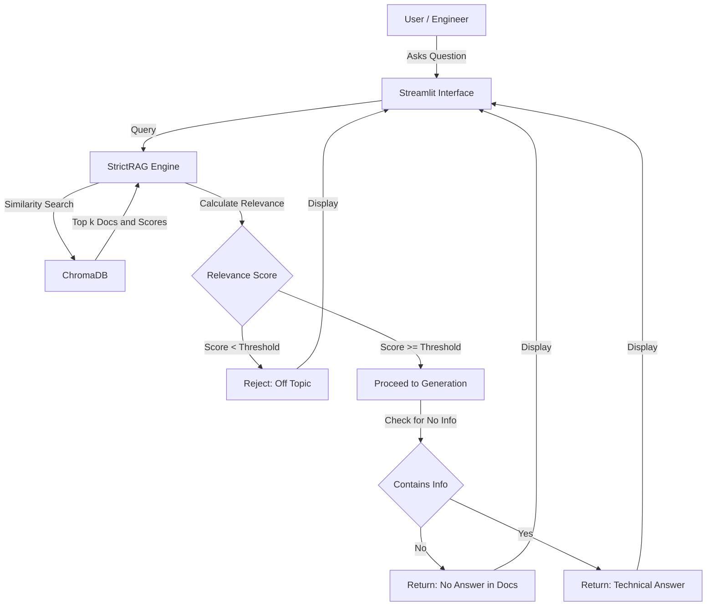

# System Architecture

## Overview

The **AI-Driven OLED Assistant** is a specialized Retrieveal-Augmented Generation (RAG) system designed to support OLED display engineers. Unlike general-purpose chatbots, it enforces a **Strict RAG** policy, ensuring that answers are derived *only* from verified internal technical documents

## System Flowchart

## Component Breakdown

### 1. User Interface (Streamlit)
- **Role**: Provides a clean, chat-like interface for engineers
- **Features**: 
  - Real-time chat history
  - Document citation display (expandable)
  - Latency and Relevance Score monitoring

### 2. Knowledge Base (ChromaDB)
- **Role**: Stores vector embeddings of technical PDFs (OLED physics, materials, fabrication)
- **Model**: `BAAI/bge-m3`
- **Persistence**: Pre-computed and stored locally to ensure zero startup latency

### 3. Strict RAG Engine (Core Logic)
- **Role**: The brain of the application. It decides *whether* to answer
- **Algorithm**:
  - Retrieves Top-K chunks
  - Calculates a **Relevance Score** using a Sigmoid function
  - If Score < `0.60` (configurable), the query is rejected immediately
  - If accepted, it prompts the LLM to use *only* the provided context

### 4. Local LLM (Mistral-Nemo)
- **Role**: Generates natural language answers
- **Deployment**: Hosted locally via **Ollama** for data security (no data leaves the local machine).
- **Configuration**: Temperature = 0.2 (Balanced: factual enough for engineering specs, but natural enough for smooth explanation without dry robotic tone)
