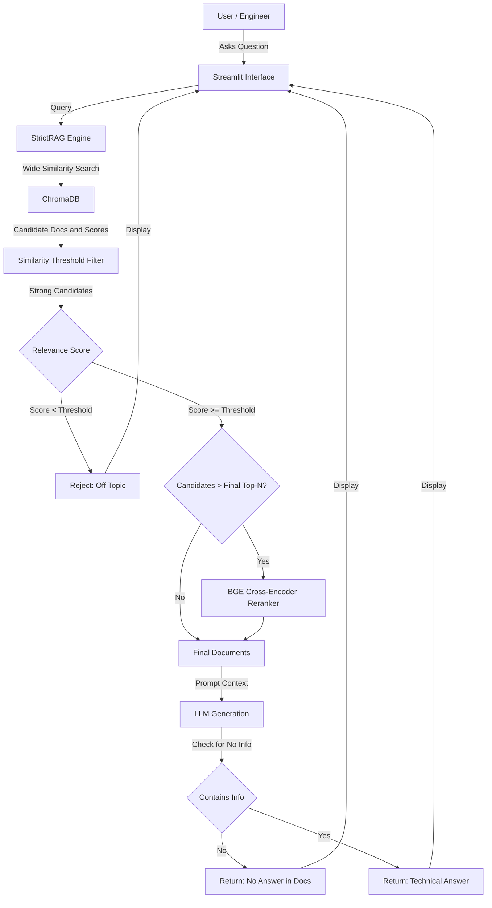

# System Architecture

## Overview

The **AI-Driven OLED Assistant** is a specialized Retrieval-Augmented Generation (RAG) system designed to support OLED display engineers. Unlike general-purpose chatbots, it enforces a **Strict RAG** policy and uses wide retrieval plus reranking so answers are grounded in the strongest available technical documents.

## System Flowchart

```mermaid
graph TD
  User["User / Engineer"] -->|Asks Question| UI["Streamlit Interface"]
  UI -->|Query| Engine["StrictRAG Engine"]

  Engine -->|Wide Similarity Search| DB["ChromaDB"]
  DB -->|Candidate Docs and Scores| Filter["Similarity Threshold Filter"]

  Filter -->|Strong Candidates| Score{"Relevance Score"}
  Score -->|Score < Threshold| OffTopic["Reject: Off Topic"]
  Score -->|Score >= Threshold| Rerank{"Candidates > Final Top-N?"}

  Rerank -->|Yes| CrossEncoder["BGE Cross-Encoder Reranker"]
  Rerank -->|No| FinalDocs["Final Documents"]
  CrossEncoder --> FinalDocs

  FinalDocs -->|Prompt Context| Generation["LLM Generation"]
  Generation -->|Check for No Info| Check{"Contains Info"}
  Check -->|No| NoAns["Return: No Answer in Docs"]
  Check -->|Yes| Final["Return: Technical Answer"]

  OffTopic -->|Display| UI
  NoAns -->|Display| UI
  Final -->|Display| UI
```

## Component Breakdown

### 1. User Interface (Streamlit)
- **Role**: Provides a clean, chat-like interface for engineers
- **Features**: 
  - Real-time chat history
  - Document citation display (expandable)
  - Latency and Relevance Score monitoring

### 2. Knowledge Base (ChromaDB)
- **Role**: Stores vector embeddings of technical PDFs (OLED physics, materials, fabrication)
- **Model**: `BAAI/bge-m3`
- **Persistence Strategy**: Cloud images include a prebuilt `chroma_db` for fast startup. At runtime, the app reuses this DB and rebuilds from `data/` only when the DB is missing or incompatible.

### 3. Strict RAG Engine (Core Logic)
- **Role**: The brain of the application. It decides *whether* to answer
- **Algorithm**:
  - Retrieves a wider candidate pool (`CANDIDATE_TOP_K = 20`)
  - Converts ChromaDB distances into similarity scores
  - Keeps candidates above `MIN_DOCUMENT_SIMILARITY = 0.50`
  - Applies a `BAAI/bge-reranker-base` cross-encoder reranker when more than `FINAL_TOP_N = 4` candidates survive
  - Calculates a **Relevance Score** using a Sigmoid function
  - If Score < `0.60` (configurable), the query is rejected immediately
  - If accepted, it prompts the LLM to use *only* the provided context

### 4. LLM Serving Strategy (Cloud + Local)
- **Role**: Generates natural language answers
- **Cloud track (public deployment)**: GPT-5-mini via OpenAI API (`OPENAI_API_KEY`) for GCP deployment and low-latency serving.
- **Internal track (private deployment)**: Mistral-Nemo via local/internal serving stack (privacy-first operation).
- **Configuration**: GPT-5-mini uses its required default temperature (`1.0`) with `reasoning_effort="minimal"` for lower RAG latency.
