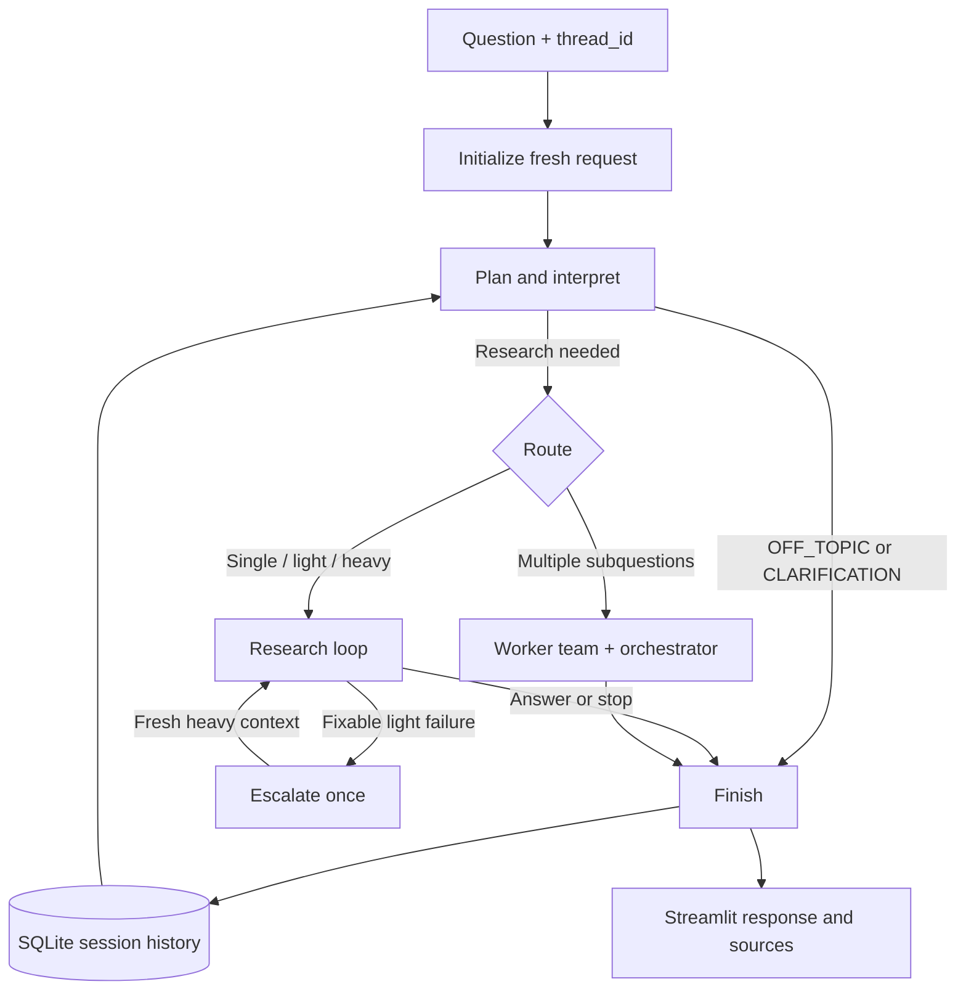

# System Architecture

The default application uses `GraphAgentAssistant` in `src/agent_graph.py`. LangGraph controls coarse nodes, routing/escalation edges, state, progress streaming and SQLite session checkpoints. Existing Python research loops still own tool execution, citations, review, revision and shared budgets.

```mermaid
flowchart TD
    Q["Question + thread_id"] --> I["Initialize fresh request"]
    I --> P["Plan and interpret"]
    S[("SQLite session history")] --> P
    P -->|"OFF_TOPIC or CLARIFICATION"| F["Finish"]
    P -->|"Research needed"| R{"Route"}
    R -->|"Single / light / heavy"| A["Research loop"]
    R -->|"Multiple subquestions"| T["Worker team + orchestrator"]
    A -->|"Fixable light failure"| E["Escalate once"]
    E -->|"Fresh heavy context"| A
    A -->|"Answer or stop"| F
    T --> F
    F --> S
    F --> U["Streamlit response and sources"]
```

## Inside research

1. The model calls `search_documents`, `submit_answer` or `declare_insufficient`.
2. Search uses normalized BGE-M3 embeddings → Chroma top 20 → relevance ≥0.50 → BGE cross-encoder rerank → up to 4 chunks.
3. Returned chunks enter the current request's evidence ledger.
4. Citations are validated before the optional heavy-model reviewer runs.
5. Reviewer feedback is returned as tool output to the **same writer context**. The orchestrator revises without restarting worker research.
6. Existing Python budgets/deadline stop the request when necessary.

## State lifetimes

| Lifetime | Data |
|---|---|
| Session | Last five user/assistant pairs, unresolved clarification |
| Request | Original/standalone question, plan, ledger, cache, counters, deadline, trace |
| Process | Model client, retriever/model weights, locks, SQLite connection |

Every invocation resets request state, including after refusal, clarification or error. Previous answers never populate the new evidence ledger. Clients, locks and model objects are not checkpoint state.

## Conversation interpretation

Without history, the original planner prompt/schema and question are used. With history or pending clarification, one planner call resolves the question, classifies its domain and plans searches. It sees at most five pairs; stored questions and previous answers are capped at 2,000 characters each.

Explicit new topics override history. Unclear essential references produce `CLARIFICATION`; the unresolved question and clarification asked are stored together. A short reply fills the missing detail. A new topic cancels it. Invalid contextual output fails closed as `ERROR`.

Research, workers, orchestrator and reviewer use `standalone_question`. Original and interpreted questions are recorded; the UI shows `Interpreted as:` when they differ. Every answer needs newly retrieved evidence. In this version, clarification is scoped to contextual follow-ups; empty-history requests keep the original planner behavior for baseline parity.

## Response modes

| Mode | Meaning |
|---|---|
| `RAG` | Cited evidence answers the core question |
| `NO_ANSWER_IN_DOCS` | Insufficient evidence or verification/budget stop; inspect stop reason |
| `OFF_TOPIC` | Clearly outside OLED/display domain |
| `CLARIFICATION` | An essential contextual detail needs user input |
| `ERROR` | API/runtime/interpretation failure |

## Persistence boundary

Streamlit generates an opaque thread ID and rotates it on New chat. It is not a URL parameter or an authorization credential. Backend callers can reconnect to a trusted thread after process restart; the UI does not automatically discover previous chats after a new browser session.

`SESSION_DB_PATH` defaults to `sessions/checkpoints.sqlite`. A persistent volume is required across container replacement: Cloud Run's local filesystem and an unmounted Kubernetes container are ephemeral. SQLite is the single-host starting point; shared multi-instance sessions need a shared checkpointer such as Postgres plus application-level user/session authorization.

Completed-turn memory is supported. Automatic replay of half-finished paid API calls after process failure is not exposed. Research-loop splitting, review nodes and `Send`/reducers remain future structural work.

See [System design](system_design.md), [Agent engine](agent_engine.md), and [Upgrade validation](upgrade_validation.md).

The current legacy baseline, stateless graph, empty-history graph and multi-turn behavior have all been measured. The validation report records the raw results, targeted repeats, judge audits and remaining boundaries.
