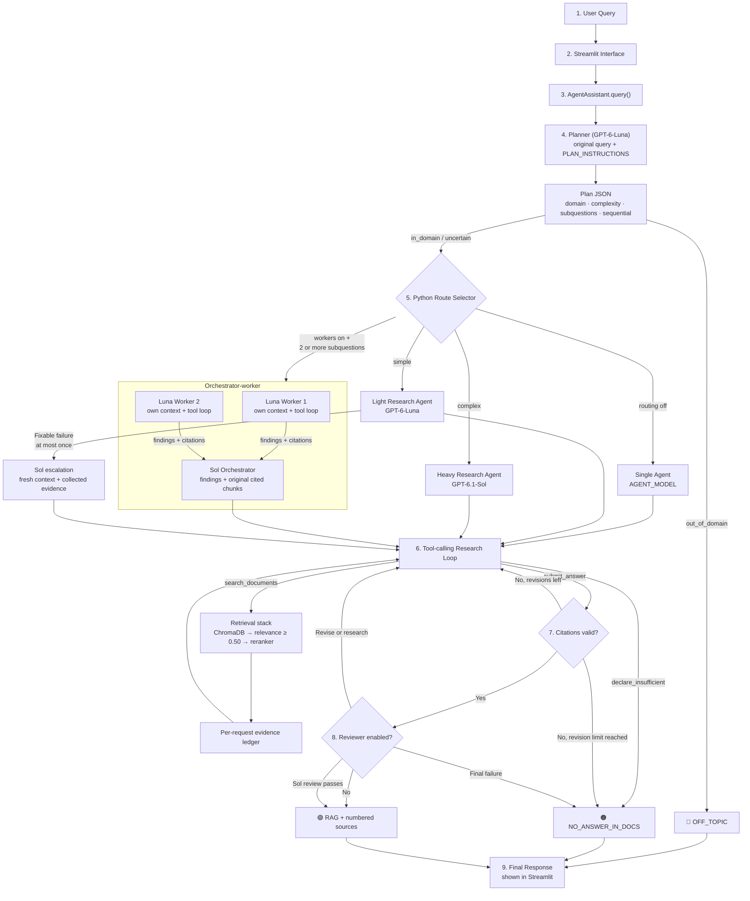

# System Architecture

## Overview

The **AI-Driven OLED Assistant** is an agentic RAG (Retrieval-Augmented Generation) system for OLED display engineers. An agent plans each question, searches the technical documents with a tool, and answers only from the chunks it cites. Unlike general-purpose chatbots, it has no fallback to the model's own knowledge: if the documents do not cover the question, it says so.

The system has three layers:

| Layer | Modules | What it does |
| :-- | :-- | :-- |
| Interface | `src/app.py` | Streamlit chat, live progress, numbered sources, agent trace |
| Agent | `src/agent_runtime.py`, `src/agent_team.py`, `src/agent_prompts.py`, `src/agent_tools.py` | Planning, model routing, orchestrator-worker, reviewer, evidence ledger, budgets |
| Retrieval | `src/retrieval.py`, `src/document_pipeline.py` | ChromaDB vector search, relevance filter, cross-encoder reranker |

The flowchart below follows one request from the user query to the final response.

## End-to-End System Flow

```mermaid
flowchart TD
    Query["1. User Query"] --> UI["2. Streamlit Interface"]
    UI --> Runtime["3. AgentAssistant.query()"]
    Runtime --> Planner["4. Planner (GPT-6-Luna)<br/>original query + PLAN_INSTRUCTIONS"]
    Planner --> Plan["Plan JSON<br/>domain · complexity · subquestions · sequential"]
    Plan -->|out_of_domain| Off["🔴 OFF_TOPIC"]
    Plan -->|in_domain / uncertain| Route{"5. Python Route Selector"}

    Route -->|"routing off"| Single["Single Agent<br/>AGENT_MODEL"]
    Route -->|"simple"| Light["Light Research Agent<br/>GPT-6-Luna"]
    Route -->|"complex"| Heavy["Heavy Research Agent<br/>GPT-6.1-Sol"]
    Route -->|"workers on +<br/>2 or more subquestions"| Team

    subgraph Team["Orchestrator-worker"]
        W1["Luna Worker 1<br/>own context + tool loop"] -->|"findings + citations"| O
        W2["Luna Worker 2<br/>own context + tool loop"] -->|"findings + citations"| O
        O["Sol Orchestrator<br/>findings + original cited chunks"]
    end

    Single & Light & Heavy & O --> Loop["6. Tool-calling Research Loop"]
    Loop -->|"search_documents"| Search["Retrieval stack<br/>ChromaDB → relevance ≥ 0.50 → reranker"]
    Search --> Ledger["Per-request evidence ledger"]
    Ledger --> Loop
    Loop -->|"declare_insufficient"| NA["🟠 NO_ANSWER_IN_DOCS"]
    Loop -->|"submit_answer"| V{"7. Citations valid?"}
    V -->|No, revisions left| Loop
    V -->|"No, revision limit reached"| NA
    V -->|Yes| R{"8. Reviewer enabled?"}
    R -->|No| RAG["🟢 RAG + numbered sources"]
    R -->|"Sol review passes"| RAG
    R -->|"Revise or research"| Loop
    R -->|"Final failure"| NA

    Light -->|"Fixable failure<br/>at most once"| Esc["Sol escalation<br/>fresh context + collected evidence"]
    Esc --> Loop

    Off --> Response["9. Final Response<br/>shown in Streamlit"]
    NA --> Response
    RAG --> Response
```

The planner is not a plan supplied by the user. `AgentAssistant.query()` sends the original user query and `PLAN_INSTRUCTIONS` to the light model (GPT-6-Luna under the current defaults), and Luna returns the structured plan. Python then validates that plan and selects the execution route. The planner does not search the documents or write the final answer.

> **One score, one scale.** Every retrieval threshold is compared against `relevance = sigmoid(cosine similarity)`. Raw cosine similarity is never compared against a threshold, because scientific text clusters too tightly in raw space to make a reliable decision axis.

## Component Breakdown

### 1. User Interface (Streamlit)

- **Role**: Provides a clean, chat-like interface for engineers
- **Features**:
  - Real-time chat history
  - Active models and agent features in the sidebar
  - Live search progress while the agent works (`st.status`)
  - Numbered inline citations and a source list with paper titles and verified DOI links (`src/source_registry.json`)
  - An **Agent Trace** expander per answer: plan, route, queries, worker and reviewer steps tagged by role, and the stop reason
  - Latency and relevance score monitoring

### 2. Knowledge Base (ChromaDB)

- **Role**: Stores vector embeddings of technical PDFs (OLED physics, materials, fabrication)
- **Model**: `BAAI/bge-m3`
- **Persistence Strategy**: Cloud images include a prebuilt `chroma_db` for fast startup. At runtime, the app reuses this DB and rebuilds from `data/` only when the DB is missing or incompatible.

### 3. Retrieval (`src/retrieval.py`)

- **Role**: The only way the agent can read the documents. Every `search_documents` call runs these steps in Python:
  - Retrieves a wider candidate pool (`CANDIDATE_TOP_K = 20`)
  - Converts every ChromaDB distance straight into a **relevance** score (cosine similarity followed by a sigmoid). The intermediate raw similarity never escapes the conversion helper
  - Keeps the documents above `MIN_DOC_RELEVANCE = 0.50`. This is the knob that controls which documents the agent sees
  - Applies a `BAAI/bge-reranker-base` cross-encoder reranker when more than `FINAL_TOP_N = 4` documents survive
- **Why it matters for the agent**: The model only chooses the query text. The thresholds come from config, so the agent cannot lower the filter or skip the reranker. Details are in [Retrieval](retrieval.md).

### 4. Agent (`src/agent_*.py`)

- **Role**: Decides _how_ to look for evidence (rewording, splitting, and searching again) and answers only with cited chunks
- **Modules**: `src/agent_runtime.py` (per-request state, planner, routing, shared tool loop, budgets, trace), `src/agent_team.py` (orchestrator-worker, reviewer), `src/agent_prompts.py` (prompts and tool schemas), and `src/agent_tools.py` (search tool, evidence ledger, citation validation)
- **Planner**: `AgentAssistant.query()` sends the original user query and `PLAN_INSTRUCTIONS` to the light model (GPT-6-Luna by default). Luna returns `domain`, `complexity`, `subquestions`, and `sequential` as structured JSON; it does not search or answer
- **Routing**: Python selects the team route first when workers are enabled and the plan has at least two subquestions. Otherwise, routing sends `simple` to Luna and `complex` to Sol
- **API**: OpenAI Responses API with function tools and reasoning. `store=False` disables Responses API response storage, while the application carries the conversation context and encrypted reasoning items between turns; several searches may be issued in one turn
- **Tools**: `search_documents(query)`, `submit_answer(answer, citations)`, `submit_findings(findings, citations)` (workers), `declare_insufficient(missing)`
- **Switchable patterns** (environment flags; all three are enabled by default):
  - model routing: simple → GPT-6-Luna, complex → GPT-6.1-Sol, plus at most one escalation from Luna to Sol in a fresh context
  - orchestrator-worker: two Luna workers with separate contexts; a Sol orchestrator receives their findings and the original cited chunks, checks the findings against that text, and writes the answer
  - reviewer: Sol checks each claim against the cited chunks. The answer is accepted only if the review is readable, the core question is answered, and no claim is unsupported. Up to two revisions are allowed, and each one is reviewed again. Statements about missing information have to be scoped to the retrieved or cited evidence
- **Guarantees enforced in Python**: The relevance filter cannot be bypassed, and only chunks retrieved in the current request can be cited. All budgets (LLM calls, searches, revisions, review rounds, time) are shared by every agent working on the question. When one runs out, the run stops instead of forcing an answer

Details are in [Agent Engine](agent_engine.md).

### 5. LLM Serving Strategy (Cloud + Local)

- **Cloud track (this repository)**: GPT-6-Luna (light) and GPT-6.1-Sol (heavy) through the OpenAI Responses API (`OPENAI_API_KEY`), both with reasoning effort `low`. With routing on (default), Luna plans, answers simple questions, and runs the workers; Sol answers complex questions and acts as orchestrator and reviewer. With routing off, every role uses `AGENT_MODEL` (Luna).
- **Internal track (private deployment)**: Mistral-Nemo via a local serving stack (privacy-first operation). It is not part of this repository.
