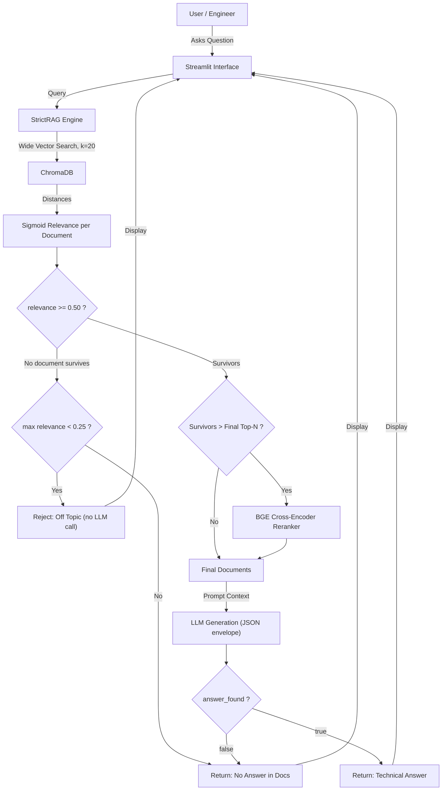

# System Architecture

## Overview

The **AI-Driven OLED Assistant** is a specialized Retrieval-Augmented Generation (RAG) system designed to support OLED display engineers. Unlike general-purpose chatbots, it enforces a **Strict RAG** policy and uses wide retrieval plus reranking so answers are grounded in the strongest available technical documents.

Two engines are available and selected with `ENGINE_MODE`:

| Engine | Flow | When it rejects |
| :--- | :--- | :--- |
| `workflow` (default) | One retrieval of the literal question → filter → rerank → one LLM call | Whenever that single retrieval is weak |
| `agent` | Plan → search tool (repeatable, parallel) → cited answer, all limits enforced in Python; model routing, orchestrator-worker, and reviewer (each switchable, all on by default) | Only after searching, or when the question is clearly not about OLEDs |

Both engines use the same ChromaDB, relevance filter, and reranker. The
flowchart below shows the workflow. The agent is described in
[Agent Engine](agent_engine.md).

## System Flowchart (workflow)

```mermaid
graph TD
  User["User / Engineer"] -->|Asks Question| UI["Streamlit Interface"]
  UI -->|Query| Engine["StrictRAG Engine"]

  Engine -->|Wide Vector Search, k=20| DB["ChromaDB"]
  DB -->|Distances| Relevance["Sigmoid Relevance per Document"]

  Relevance --> Filter{"relevance >= 0.50 ?"}

  Filter -->|"No document survives"| Gate{"max relevance < 0.25 ?"}
  Gate -->|Yes| OffTopic["Reject: Off Topic (no LLM call)"]
  Gate -->|No| NoAns["Return: No Answer in Docs"]

  Filter -->|"Survivors"| Rerank{"Survivors > Final Top-N ?"}
  Rerank -->|Yes| CrossEncoder["BGE Cross-Encoder Reranker"]
  Rerank -->|No| FinalDocs["Final Documents"]
  CrossEncoder --> FinalDocs

  FinalDocs -->|Prompt Context| Generation["LLM Generation (JSON envelope)"]
  Generation --> Check{"answer_found ?"}
  Check -->|false| NoAns
  Check -->|true| Final["Return: Technical Answer"]

  OffTopic -->|Display| UI
  NoAns -->|Display| UI
  Final -->|Display| UI
```

> **One score, one scale.** Every threshold above is compared against
> `relevance = sigmoid(cosine similarity)`. Raw cosine similarity is never
> compared against a threshold, because scientific text clusters too tightly in
> raw space to make a reliable decision axis.

## Component Breakdown

### 1. User Interface (Streamlit)
- **Role**: Provides a clean, chat-like interface for engineers
- **Features**: 
  - Real-time chat history
  - Source list with paper titles and verified DOI links (`src/source_registry.json`)
  - Latency and Relevance Score monitoring
  - Agent mode only: active models and features in the sidebar, live search
    progress, numbered inline citations, and an **Agent Trace** expander (plan,
    route, queries, worker and reviewer steps tagged by role, stop reason)

### 2. Knowledge Base (ChromaDB)
- **Role**: Stores vector embeddings of technical PDFs (OLED physics, materials, fabrication)
- **Model**: `BAAI/bge-m3`
- **Persistence Strategy**: Cloud images include a prebuilt `chroma_db` for fast startup. At runtime, the app reuses this DB and rebuilds from `data/` only when the DB is missing or incompatible.

### 3. Strict RAG Engine (Core Logic)
- **Role**: The brain of the application. It decides *whether* to answer
- **Algorithm**:
  - Retrieves a wider candidate pool (`CANDIDATE_TOP_K = 20`)
  - Converts every ChromaDB distance straight into a **relevance** score
    (cosine similarity followed by a sigmoid). The intermediate raw similarity
    never escapes the conversion helper
  - Keeps the documents above `MIN_DOC_RELEVANCE = 0.50`. This is the only knob
    that controls which documents reach the LLM
  - Applies a `BAAI/bge-reranker-base` cross-encoder reranker when more than
    `FINAL_TOP_N = 4` documents survive
  - When *nothing* survives, `OFF_TOPIC_THRESHOLD = 0.25` picks the rejection
    message: below it the question is out of domain, above it the question is
    in domain but uncovered by our corpus
  - If accepted, it prompts the LLM to use *only* the provided context and to
    report grounding through an explicit `answer_found` flag

> **Why the gate is loose while the filter is strict.** The two thresholds
> answer different questions. The filter asks "is this document worth showing
> the LLM?", so it guards answer quality. The gate only asks "was this question
> ever about OLED?", so it just labels the rejection. Measured on the current
> corpus, off-topic queries peak at `0.059` relevance while on-topic queries
> start at `0.652`, which leaves a wide margin for a loose gate.

### 4. Agent Engine (`ENGINE_MODE=agent`)
- **Role**: Decides *how* to look for evidence (rewording, splitting, and
  searching again), instead of judging everything from one retrieval
- **Modules**: `src/agent_runtime.py` (per-request state, planner, routing,
  shared tool loop, budgets, trace), `src/agent_team.py` (orchestrator-worker,
  reviewer), `src/agent_prompts.py` (prompts and tool schemas), and
  `src/agent_tools.py` (search tool, evidence ledger, citation validation)
- **API**: OpenAI Responses API with function tools and reasoning
  (`store=False`); several searches may be issued in one turn
- **Tools**: `search_documents(query)`, `submit_answer(answer, citations)`,
  `submit_findings(findings, citations)` (workers), `declare_insufficient(missing)`
- **Switchable patterns** (environment flags; all three are enabled by default):
  - model routing: simple → GPT-6 Luna, complex → GPT-6.1 Sol, plus at most one
    escalation from Luna to Sol in a fresh context
  - orchestrator-worker: two Luna workers with separate contexts; a Sol
    orchestrator checks their findings against the original chunk text
  - reviewer: Sol checks each claim against the cited chunks. The answer is
    accepted only if the review is readable, the core question is answered,
    and no claim is unsupported. Up to two revisions are allowed, and each one
    is reviewed again. Statements about missing information have to be scoped
    to the retrieved or cited evidence
- **Guarantees enforced in Python**: The relevance filter cannot be bypassed,
  and only chunks retrieved in the current request can be cited. All budgets
  (LLM calls, searches, revisions, review rounds, time) are shared by every
  agent working on the question. When one runs out, the run stops instead of
  forcing an answer

### 5. LLM Serving Strategy (Cloud + Local)
- **Role**: Generates natural language answers
- **Cloud track (public deployment)**: GPT-5-mini via OpenAI API (`OPENAI_API_KEY`) for GCP deployment and low-latency serving.
- **Internal track (private deployment)**: Mistral-Nemo via local/internal serving stack (privacy-first operation).
- **Configuration**: GPT-5-mini uses its required default temperature (`1.0`) with `reasoning_effort="minimal"` for lower RAG latency.
- **Agent engine**: GPT-6 Luna (light) and GPT-6.1 Sol (heavy) with reasoning effort `low`. With routing on (default), Sol answers the complex questions and also acts as orchestrator and reviewer. With routing off, every role uses `AGENT_MODEL` (Luna).
